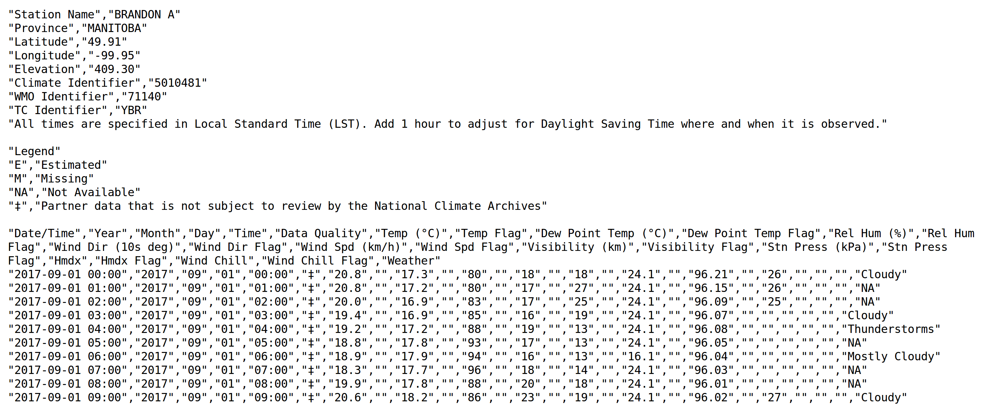

class: title-slide, nologo


```{r setup, include=FALSE}
knitr::opts_chunk$set(echo = TRUE, cache = FALSE, out.width = "100%", dpi = 300)
```

```{r libraries, include = FALSE, cache = FALSE}
library(weathercan)
library(tidyverse)
library(tibble)
options(tibble.print_max = 10, tibble.print_min = 10, tibble.max_extra_cols = 0,
        width = 100)
```

```{r data, include = FALSE}
set.seed(1000)
sediment <- tibble::tibble(time = seq(as.POSIXct("2017-09-01 00:05:34"), as.POSIXct("2017-09-30"), by = "30 min")) %>%
  mutate(time = lubridate::force_tz(time, "Etc/GMT+6"),
         amount = rnorm(n(), mean = 175, sd = 15))
```

### Steffi LaZerte & Sam Albers

# `weathercan`

## An R package for accessing<br>Environment and Climate Change Canada weather data

.align-bottom-left[  @steffilazerte  steffilazerte  steffilazerte.ca]

.align-bottom-right[PCAG 2017]


---
# Historical weather data

- Environment and Climate Change Canada
- 1840 to Present
- Hourly, daily, monthly intervals
- \> 26,000 stations (past and present)

--

> **Lots of Data!**


---
background-image: url("./Figures/ECCC_historical.png")
background-size: 85%
background-position: 50% 100%

# Accessing data from ECCC website

---
background-image: url("./Figures/ECCC_historical2.png")
background-size: 90%
background-position: 50% 50%

---
background-image: url("./Figures/ECCC_historical3.png")
background-size: 60%
background-position: 50% 50%

--

<!-- <div class = "arrow-left" style = "position:absolute; right: 370px; bottom: 300px;border: 5px solid red;width:100px; height:50px;border-radius: 10px;"></div> -->

<div class = "box" style = "position:absolute; right:70px; bottom:220px;">Download<br>Data!</div>


---
# Data good but not ready
.center[]


---
background-image: url("./Figures/weathercan_logo.png")
background-size: 450px
background-position: 50% 70%
class: center, nologo

# .red[`weathercan`]: An R package

---
background-image: url("./Figures/R_sm.png")
background-size: 200px
background-position: 50% 80%
class: center, nologo

.spacer[ ]

# .center.Rblue[What's R?]

.spacer[ ]

--

### An open source, programming language, and software environment


---
class: center, nologo

.spacer[ ]

# .center.Rblue[What's R?]

.spacer[ ]

### An open source, programming language, and software environment

Often used with RStudio IDE 


---
background-image: url("./Figures/Rexample.png")
background-size: cover
class: nologo


---

# Getting started with .red[`weathercan`]

.spacer[ ]

#### Installing `devtools`
```{r, eval = FALSE}
install.packages("devtools")

```

#### Installing `weathercan` with `devtools`
```{r, eval = FALSE}
devtools::install_github("steffilazerte/weathercan", build_vignettes = TRUE)
```

---
# Basic usage

#### Code
```{r, eval = FALSE}
library(weathercan)
w <- weather(station_ids = c(50821, 51097), start = "2017-09-01")
```

--
#### Output
```{r, echo = FALSE, R.options=list(tibble.print_max = 5, tibble.print_min = 5)}
library(weathercan)
weather(station_ids = c(50821, 51097), start = "2017-09-01") %>%
  select(-date, -year, -month, -day, -hour, -qual, -weather)
```

--

<div class = "redbox" style = "top: 31.5%; right: 57%; width: 168px; height: 30px;"></div>
<div style = "position: absolute; top: 19%; right: 64%;"><h2><strong>?<strong></h3></div>

---
# Locating a station

```{r, eval = FALSE}
stations
```

--

```{r, echo = FALSE}
stations %>%
  select(-WMO_id, -TC_id) %>%
  arrange(station_name, station_id)
```


---
# Searching by station name

```{r, eval = FALSE}
stations_search(name = "Brandon")
```

--

```{r, echo = FALSE}
stations_search(name = "Brandon") %>%
  select(-WMO_id, -TC_id)
```

--

<div class = "redbox" style = "width: 93px; height: 400px; right: 240px; top: 205px"></div>

---
# Searching by station name

```{r, eval = FALSE}
stations_search(name = "Brandon", interval = "hour")
```

--

```{r, echo = FALSE}
stations_search(name = "Brandon", interval = "hour") %>%
  select(-WMO_id, -TC_id)
```

---
# Searching by station name
```{r, eval = FALSE}
stations_search(name = "(Brandon)|(Winnipeg)", interval = "hour")
```

--

```{r, echo = FALSE}
stations_search(name = "(Brandon)|(Winnipeg)", interval = "hour") %>%
  select(-WMO_id, -TC_id)
```

--

<div class = "highlightbox" style = "top: 46%; right: 50%; height: 35px; width: 350px;"></div>
<div class = "highlightbox" style = "top: 60%; right: 50%; height: 35px; width: 350px;"></div>

> Make a note: 50821 (Brandon) and 51097 (Winnipeg)

---
# Alternative: Searching by coordinates

- Alternatively search according to location: `c(latitude, longitude)`
- Search within 10km of this location: `dist = 10`

```{r, eval = FALSE}
stations_search(coords = c(49.84847, -99.95009), dist = 10, interval = "hour")
```

--

```{r, echo = FALSE}
stations_search(coords = c(49.84847, -99.95009), dist = 10, interval = "hour") %>%
  select(-WMO_id, -TC_id)
```


---
# Downloading data

```{r}
w <- weather(station_ids = c(50821, 51097), start = "2017-09-01")
```

--

```{r, echo = FALSE}
w %>%
  select(-date, -year, -month, -day, -hour, -qual, -weather)
```


---
# Plotting
```{r, fig.asp = 0.35, warning = FALSE}
library(ggplot2)

ggplot(data = w, aes(x = time, y = temp, colour = station_name)) +
  geom_line()
```


---
# With a bit of formating...

```{r, fig.asp = 0.35}
ggplot(data = w, aes(x = time, y = temp, colour = station_name)) +
  theme_bw() +
  geom_line() +
  labs(x = "Date", y = "Temperature C", colour = "Station")
```


---
exclude: true

# Again with Pressure
```{r, fig.asp = 0.25}
ggplot(data = w, aes(x = time, y = pressure, colour = station_name)) +
  theme_bw() +
  geom_line() +
  labs(x = "Date", y = "Pressure (kPa)", colour = "Station")
```

---
background-image: url("./Figures/flags_vignette.png")
background-position: 50% 90%
background-size: 72.5%

# Understanding the data

```{r, eval = FALSE}
vignette("flags", package = "weathercan")
```


---
background-image: url("./Figures/glossary_vignette.png")
background-position: 50% 90%
background-size: 65%

# Understanding the data

```{r, eval = FALSE}
vignette("glossary", package = "weathercan")
```


---
# Combining with other data

- Adding weather data (from a single station) to other data sets
- Times don't always line up

--

.pull-left[
#### Sediment data
```{r, echo = FALSE, R.options = list(tibble.print_max = 7, tibble.print_min = 7)}
sediment
```
]

.pull-right[
#### Brandon Weather data
```{r, echo = FALSE, R.options = list(tibble.print_max = 7, tibble.print_min = 7)}
w <- filter(w, station_name == "BRANDON A")
w %>% select(time, temp, pressure)
```
]

<div class = "highlightbox" style = "left: 18%; top: 58%; height:32%; width:8%"></div>
<div class = "highlightbox" style = "right: 24.5%; top: 58%; height:32%; width:8%"></div>


---
# Interpolating

- Linear interpolation where possible

```{r}
w <- weather(station_ids = 50821, start = "2017-09-01")
```

```{r}
sediment <- add_weather(data = sediment, 
                        weather = w, 
                        col = c("temp", "pressure"))
```

---
# Interpolating

.pull-left-55[
#### Sediment data
```{r, echo = FALSE, R.options = list(tibble.print_max = 7, tibble.print_min = 7)}
sediment
```
]

.pull-right-45[
#### Weather data
```{r, echo = FALSE, R.options = list(tibble.print_max = 7, tibble.print_min = 7)}
w %>% select(time, temp, pressure)
```
]

<div class = "highlightbox" style = "left: 34%; top: 41.5%; height:32%; width:8%"></div>
<div class = "highlightbox" style = "right: 14%; top: 41.5%; height:32%; width:5%"></div>


---
# Recap!

--

#### 1. Load `weathercan` package
```{r, eval = FALSE}
library(weathercan)
```

--

#### 2. Find a station
```{r, eval = FALSE}
stations_search("Brandon")
```

--

#### 3. Download weather
```{r, eval = FALSE}
w <- weather(station_ids = 50821, start = "2017-09-01")
```

--

#### 4. Add weather data to an existing data set
```{r, eval = FALSE}
sediment <- add_weather(data = sediment, weather = w, cols = "temp")
```

---
class: final-slide, nologo
# Help with .red[`weathercan`]

- **Tutorials and Reference:** <http://steffilazerte.github.io/weathercan>
- **Bugs and Development:** <http://github.com/steffilazerte/weathercan>
- **This presentation:** 
- **Contact Steffi:**   @steffilazerte  steffilazerte  steffilazerte.ca

--

<div style = "position:absolute; bottom: 27%"> <h2>Thanks!</h2></div>


<div style = "position:absolute; bottom: 20%; left: 4%">Dr. David J. Hill <br></div>


.small[.align-bottom-left[Slides created via the R package [xaringan](https://github.com/yihui/xaringan), using [remark.js](https://remarkjs.com), [knitr](http://yihui.name/knitr), and [R Markdown](https://rmarkdown.rstudio.com)<br> <code class = "remark-inline-code">weathercan v0.2.3</code>]]
