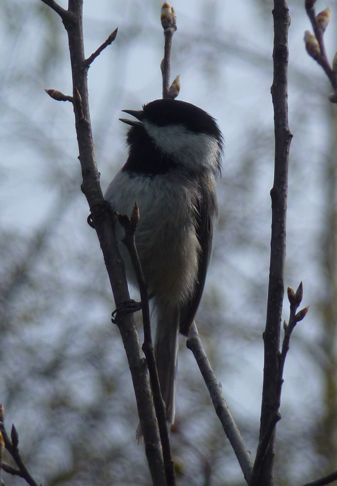
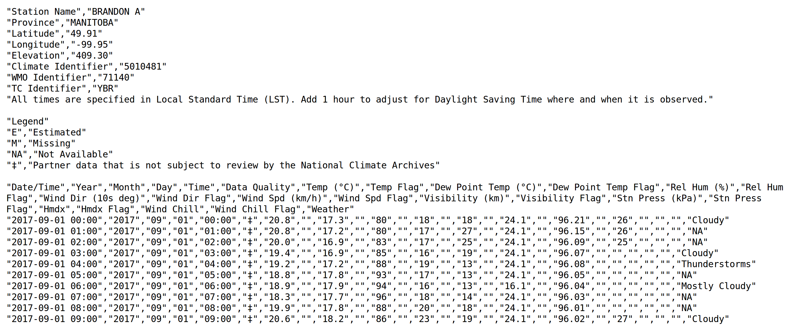

class: title-slide, nologo


```{r setup, include = FALSE}
library(knitr)
opts_chunk$set(echo = TRUE, cache = FALSE, out.width = "100%", dpi = 300)

hook_output <- knit_hooks$get("output")
knit_hooks$set(output = function(x, options) {
  extra <- options$extra
  
  if(is.null(extra)) {
    return(hook_output(x, options))  # pass to default hook
  }
  x <- hook_output(x, options)
  if(any(extra == "squish")) x <- paste0("\n.narrow[", x, "]")
  if(any(extra == "pause")) x <- paste0("--\n", x)
  x
})
```

```{r libraries, include = FALSE, cache = FALSE}
library(weathercan)
library(tidyverse)
library(tibble)
options(tibble.print_max = 10, tibble.print_min = 10, tibble.max_extra_cols = 0,
        width = 100)
```

```{r data, include = FALSE}
set.seed(1000)
sediment <- tibble::tibble(time = seq(as.POSIXct("2017-09-01 00:05:34"), as.POSIXct("2017-09-30"), by = "30 min")) %>%
  mutate(time = lubridate::force_tz(time, "Etc/GMT+6"),
         amount = rnorm(n(), mean = 175, sd = 15))
```

### Dr. Steffi LaZerte

# `weathercan`

## An R package for accessing<br>Environment and Climate Change Canada weather data

.align-bottom-left[  @steffilazerte  steffilazerte  steffilazerte.ca  sel@steffilazerte.ca]

.align-bottom-right[July 2018]


---
# A bit of background

#### Dr. Steffi LaZerte




.spacer[]

**Biologist (Animal Behaviour)**

- BSc University of Toronto
- MSc McGill University
- PhD University of Northern BC

.spacer[]

--

**Working with R since 2007**

- Analysis requires a lot of data prep!

---
# A bit of background

#### Dr. Steffi LaZerte

.spacer[]

**Independent biological consultant and R programmer**

- Data cleaning, summarizing, and analysis
- Custom R packages and scripts
- R tutoring and workshops


--

<div class = "redbox" style = "right: 100px; top: 250px">Solving data problems</div>


---
# Historical weather data

- Available from Environment and Climate Change Canada (ECCC)
- 1840 to Present
- Hourly, daily, monthly intervals
- \> 8,000 stations (past and present)

--

> **Lots of Data!**


---
background-image: url("./Figures/ECCC_historical.png")
background-size: 85%
background-position: 50% 100%

# Accessing data from ECCC website

---
background-image: url("./Figures/ECCC_historical2.png")
background-size: 90%
background-position: 50% 50%

---
background-image: url("./Figures/ECCC_historical3.png")
background-size: 60%
background-position: 50% 50%

--

<!-- <div class = "arrow-left" style = "position:absolute; right: 370px; bottom: 300px;border: 5px solid red;width:100px; height:50px;border-radius: 10px;"></div> -->

<div class = "highlightbox" style = "right: 23%; bottom: 36%; width: 200px; height: 90px;"></div>


---
# Data good but not ready
.center[]


---
background-image: url("./Figures/weathercan_logo.png")
background-size: 450px
background-position: 50% 70%
class: center, nologo

# .red[`weathercan`]: An R package

---
background-image: url("./Figures/R_sm.png")
background-size: 200px
background-position: 50% 80%
class: center, nologo

.spacer[ ]

# .center.Rblue[What's R?]

.spacer[ ]

--

### An open source, programming language, and software environment


---
class: center, nologo

.spacer[ ]

# .center.Rblue[What's R?]

.spacer[ ]

### An open source, programming language, and software environment

Often used with RStudio IDE 


---
background-image: url("./Figures/Rexample.png")
background-size: cover
class: nologo


---
# Why use `weathercan`?

--

<div style = "height: 10px;"></div>

#### Free
- Free *and* open-source software (FOSS)

--

#### Fast and Easy
- One line of code to download data from many stations, over many years
- Instantly usable

--

#### Customizable
- Data is trimmed to start and end times
- You can specify stations, time intervals, timezones, etc.

---
# Why use `weathercan`?

.spacer[ ]

.spacer[ ]

#### **Reproducible!**

> - Scripts provide a record of actions  
> - Make a note of the `weathercan` version (`packageVersion(weathercan)`)
> - Hard to document mouse clicks or website searches


---

# Getting started with .red[`weathercan`]

.spacer[ ]

#### Latest stable version (v`r packageVersion("weathercan")`):
```{r, eval = FALSE}
install.packages("weathercan")
```

.spacer[ ]

#### Developmental version (v`r suppressMessages(rvcheck::check_github("ropensci/weathercan")$latest_version)`):

```{r, eval = FALSE}
library(devtools)
install_github("ropensci/weathercan", build_vignettes = TRUE)
```


---
# Basic usage

#### Code
```{r, eval = FALSE}
library(weathercan)
w <- weather_dl(station_ids = c(50821, 51097), start = "2017-09-01", interval = "hour")
```

--
#### Output
```{r, echo = FALSE, R.options=list(tibble.print_max = 5, tibble.print_min = 5)}
library(weathercan)
w <- weather_dl(station_ids = c(50821, 51097), start = "2017-09-01")
w %>% select(-date, -year, -month, -day, -hour, -weather)
```

--
<div class = "redbox" style = "top: 27.25%; right: 17.5%; width: 150px; height: 0px;padding: 2px;"></div>
<div style = "position: absolute; top: 18%; right: 18.5%;"><h5><strong>"day" or "month"<strong></h5></div>

---
# Plotting

```{r, fig.asp = 0.28}
library(ggplot2)
ggplot(data = w, aes(x = time, y = temp, colour = station_name)) +
  theme_bw() +
  geom_line() +
  scale_colour_viridis_d(end = 0.5) +
  labs(x = "Date", y = "Temperature C", colour = "Station")
```

---
# And done!

```{r, eval = FALSE}
library(weathercan)
w <- weather_dl(station_ids = c(50821, 51097), start = "2017-09-01", interval = "hour")

ggplot(data = w, aes(x = time, y = temp, colour = station_name)) +
  theme_bw() +
  geom_line() +
  scale_colour_viridis_d(end = 0.5) +
  labs(x = "Date", y = "Temperature C", colour = "Station")
```


---

# Hmmm...

```{r, eval = FALSE}
library(weathercan)
w <- weather_dl(station_ids = c(50821, 51097), start = "2017-09-01")

ggplot(data = w, aes(x = time, y = temp, colour = station_name)) +
  theme_bw() +
  geom_line() +
  scale_colour_viridis_d(end = 0.5) +
  labs(x = "Date", y = "Temperature C", colour = "Station")
```

<div class = "highlightbox" style = "top: 23%; right: 55%; width: 170px; height: 30px;"></div>
<div style = "position: absolute; top: 13%; right: 62%;"><h2><strong>?<strong></h3></div>

--

.spacer[ ]

> How do we get station ids?

---

# Stations data set

```{r, extra = "pause"}
stations
```

---

# Searching by station name

```{r}
stations_search(name = "Brandon")
```

--
<div class = "highlightbox" style = "width: 90px; height: 380px; right: 15.5%; top: 32.5%"></div>


---
# Searching by station name

```{r, extra = "pause"}
stations_search(name = "Brandon", interval = "hour")
```


---
# Searching by station name (fancy)
```{r, extra = "pause"}
stations_search(name = "Brandon|Winnipeg", interval = "hour")
```

--

<div class = "highlightbox" style = "top: 46%; right: 65%; height: 35px; width: 280px;"></div>
<div class = "highlightbox" style = "top: 59.75%; right: 65%; height: 35px; width: 280px;"></div>

> Make a note: 50821 (Brandon) and 51097 (Winnipeg)

---
# Alternative: Searching by coordinates

- Search according to location: `c(latitude, longitude)`
- Search within 10km of this location: `dist = 10`


```{r, extra = c("pause", "squish"), cache = FALSE, R.options = list(width = 120)}
stations_search(coords = c(49.84847, -99.95009), dist = 10, interval = "hour")
```

--

<div class = "highlightbox" style = "top: 57%; right: 9.25%; height: 80px; width: 55px;"></div>

---
# Alternative: Searching with `tidyverse`

> Note here we're using the `stations` data frame directly

```{r, extra = "squish"}
library(tidyverse)
stations %>%
  filter(prov == "MB", start > 2000, interval == "day")
```


---
# Understanding the data

#### Flags

For each measurement there is a corresponding 'flag' column

.compact[
```{r}
w_month <- weather_dl(station_id = 5401, start =  "2017-01-01", interval = "month")
names(w_month)  # List all the column names
```
]

--

<div class = "highlightbox" style = "bottom: 17.5%; left: 11%; height: 25px; width: 230px;"></div>
<div class = "highlightbox" style = "bottom: 21.5%; right: 23.5%; height: 25px; width: 230px;"></div>

---
# Understanding the data

#### Flags

.compact[
```{r}
select(w_month, date, mean_temp, mean_temp_flag) # Pull out some columns
```
]

--

<div class = "highlightbox" style = "bottom: 33%; left: 23.5%; height: 30px; width: 75px;"></div>


---
background-image: url("./Figures/flags_vignette.png")
background-position: 50% 90%
background-size: 65%

# Understanding the data

#### Flags

```{r, eval = FALSE}
vignette("flags", package = "weathercan")
```


---
# Understanding the data

#### Units and measurements
```{r, echo = FALSE}
w %>% 
  dplyr::select(station_id, time, temp, temp_dew, rel_hum, wind_dir)
```


---
background-image: url("./Figures/glossary_vignette.png")
background-position: 50% 95%
background-size: 60%

# Understanding the data

#### Units and measurements

```{r, eval = FALSE}
vignette("glossary", package = "weathercan")
```


---
# Combining with other data

- Adding weather data to other data sets
- Times don't always line up

--

.pull-left[
#### Sediment data (for example)
```{r, echo = FALSE, R.options = list(tibble.print_max = 7, tibble.print_min = 7)}
sediment
```
]

.pull-right[
#### Brandon weather data
```{r, echo = FALSE, R.options = list(tibble.print_max = 7, tibble.print_min = 7)}
w <- filter(w, station_name == "BRANDON A")
w %>% select(time, temp, pressure)
```
]

<div class = "highlightbox" style = "left: 18%; top: 55%; height:32%; width:8%"></div>
<div class = "highlightbox" style = "right: 24.5%; top: 55%; height:32%; width:8%"></div>


---
# Interpolating

- Linear interpolation where possible
- Only a single weather station at a time

```{r}
w <- weather_dl(station_ids = 50821, start = "2017-09-01")
```

```{r}
sediment <- weather_interp(data = sediment, 
                           weather = w,
                           col = c("temp", "pressure"))
```

--

> Note messages regarding missing data. These are just a 'heads up', not errors

---
# Interpolating

.pull-left-55[
#### Sediment & weather data
```{r, echo = FALSE, R.options = list(tibble.print_max = 7, tibble.print_min = 7)}
sediment
```
]

.pull-right-45[
#### Original weather data
```{r, echo = FALSE, R.options = list(tibble.print_max = 7, tibble.print_min = 7)}
w %>% select(time, temp, pressure)
```
]

<div class = "highlightbox" style = "left: 33%; top: 40.5%; height:32%; width:5%"></div>
<div class = "highlightbox" style = "right: 14.25%; top: 40.5%; height:32%; width:5%"></div>


---
background-image: url("./Figures/weathercan_logo.png")
background-size: 450px
background-position: 50% 70%
class: center, nologo

# Taking .red[`weathercan`] to the next level...

---
# Getting the most out of `weathercan`

#### 1. Download from multiple stations (spatial)

.compact[
```{r}
mb <- filter(stations, prov == "MB", start <= "2018", end >= "2018", interval == "hour")
mb
```
]

---
# Getting the most out of `weathercan`

```{r, message = FALSE}
manitoba <- weather_dl(station_ids = mb$station_id, start = "2018-07-01")
```


> Big data sets can take time to download: save the output for later

```{r}
write_csv(manitoba, "./Data/manitoba_2018-07-01.csv")
```


---
# Getting the most out of `weathercan`

.compact[
```{r, warning = FALSE, fig.asp = 0.33, fig.width = 10}
ggplot(manitoba, aes(x = date, y = temp)) +
  stat_summary(geom = "ribbon", fun.y = median, fun.ymax = max, fun.ymin = min, alpha = 0.5) +
  stat_summary(geom = "line", fun.y = median) +
  labs(title = "July 2018 Min/Median/Max Temperatures in Manitoba, Canada",
       x = "Date", y = "Temperature C")
```
]

---

# Getting the most out of `weathercan`

```{r, echo = FALSE, fig.asp = 0.48, fig.width = 10, message = FALSE}
library(rnaturalearth)
library(sf)

mb <- ne_states(country = "Canada", returnclass = "sf") %>%
  filter(name == "Manitoba")

m <- st_as_sf(manitoba, coords = c("lon", "lat")) %>%
  filter(date > "2018-07-01") %>%
  group_by(station_id) %>%
  summarize(temp = mean(temp, na.rm = TRUE),
            pressure = mean(pressure, na.rm = TRUE)) %>%
  arrange(temp)

st_crs(m) <- st_crs(mb)

gridExtra::grid.arrange(
  ggplot(m) +
    theme_minimal() +
    theme(legend.position = c(0.9, 0.2)) +
    geom_sf(data = mb) +
    geom_sf(aes(colour = temp), size = 5, shape = 20, show.legend = "point") +
    scale_size(range = c(1, 10)) +
    scale_colour_gradient(low = "blue", high = "red") +
    labs(colour = "Mean Temperature (C\u00B0)\n July 2018"),
  ggplot(m) +
    theme_minimal() +
    theme(legend.position = c(0.9, 0.2)) +
    geom_sf(data = mb) +
    geom_sf(aes(colour = pressure), size = 5, shape = 20, show.legend = "point") +
    scale_size(range = c(1, 10)) +
    scale_colour_gradient(high = "orange", low = "darkgreen") +
    labs(colour = "Mean Air Pressure (C\u00B0)\n July 2018"),
  nrow = 1)
```
  
  
---

# Getting the most out of `weathercan`

#### 2. Download from multiple years (temporal)

- no '`start`' means download until the '`end`' date
- no '`end`' means download from the '`start`' date to the present (or end of the data record)
- no '`start`' OR '`end`' means download all data

**Download ALL data:**
```{r, message = FALSE}
w <- weather_dl(station_ids = c(3472, 3698), interval = "month")
write_csv(w, "./Data/brandon_winnipeg_historical.csv")
```


---

# Getting the most out of `weathercan`

```{r, warning = FALSE, fig.width = 10, fig.asp = 0.28, message = FALSE}
ggplot(data = w, aes(x = mean_temp, fill = station_name)) +
  theme_bw() +
  geom_density(alpha = 0.5) +
  scale_fill_viridis_d(end = 0.5) +
  labs(title = "Distribution of Monthly Mean Temperatures", 
       x = "Temperature C", y = "Density", fill = "Station")
```


---
# Recap!

--

#### 1. Load `weathercan` package
```{r, eval = FALSE}
library(weathercan)
```

--

#### 2. Find a station
```{r, eval = FALSE}
stations_search("Brandon")
```

--

#### 3. Download weather
```{r, eval = FALSE}
w <- weather_dl(station_ids = 50821, start = "2017-09-01")
```

--

#### 4. Add weather data to an existing data set
```{r, eval = FALSE}
sediment <- weather_interp(data = sediment, weather = w, cols = "temp")
```


---
# Last, but not least

#### 5. Cite `weathercan`

```{r, eval = FALSE}
citation("weathercan")
```


```{r, echo = FALSE}
print(citation("weathercan"), bibtex = FALSE)
```

`weathercan` is 

- Part of the [ropensci project](https://ropensci.org/)
- Published in [Journal of Open Source Software](https://joss.theoj.org/)

Both involve rigorous review of code, best-practices and usability
  


---
# We invite contributions!

.spacer[ ] 

#### Openly developed on GitHub 

.spacer[ ]

Contribute what you can (**You don't have to be an R programmer!**):

- Ideas / Feature-requests
- Bugs
- Bug-fixes
- Development

.spacer[ ] 

 : <http://github.com/ropensci/weathercan>

---
class: final-slide, nologo
# Get help with .red[`weathercan`]

**Tutorials and Reference:** <http://ropensci.github.io/weathercan>  
**This presentation:** <https://steffilazerte.github.io/Presentations/>  

.spacer[ ]

**Contact Steffi:**    @steffilazerte  steffilazerte  steffilazerte.ca  sel@steffilazerte.ca


--

<div style = "position:absolute; bottom: 25%"> <h2>Thanks!</h2></div>


.small[.align-bottom-left[Slides created with the R package [xaringan](https://github.com/yihui/xaringan), using [remark.js](https://remarkjs.com), [knitr](http://yihui.name/knitr), and [R Markdown](https://rmarkdown.rstudio.com)<br> <code class = "remark-inline-code">Compiled on `r Sys.Date()` with weathercan v`r packageVersion("weathercan")`</code>]]


