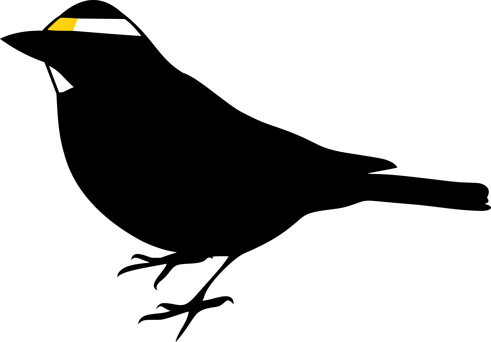

class: title-slide, nologo


```{r prep, include = FALSE}
library(tidyverse)
library(knitr)
library(lme4)
library(multcomp)

library(cavityuse)

opts_chunk$set(echo = FALSE, cache = FALSE, dpi = 300,
               out.extra = "class = 'fig-right'", fig.width = 3.5,
               fig.height = 3.75)

hook_output <- knit_hooks$get("output")
knit_hooks$set(output = function(x, options) {
  extra <- options$extra
  
  if(is.null(extra)) {
    return(hook_output(x, options))  # pass to default hook
  }
  x <- hook_output(x, options)
  if(any(extra == "squish")) x <- paste0("\n.narrow[", x, "]")
  if(any(extra == "pause")) x <- paste0("--\n", x)
  x
})

overall_day <- read_csv("./Data/overall_day.csv") %>%
  mutate(loc_sp = factor(loc_sp))
incubation_day <- read_csv("./Data/incubation_day.csv") %>%
  mutate(comments = factor(comments, levels = c("incubating", "brooding", "other")))
overall_night <- read_csv("./Data/overall_night.csv") %>%
  mutate(location = factor(location, levels = c("in", "ambig", "out")))
incubation_night <- read_csv("./Data/incubation_night.csv") %>%
  mutate(comments = factor(comments, levels = c("incubating", "brooding", "other")))
overall_breeding <- read_csv("./Data/overall_breeding.csv")
overall_calib <- read_csv("./Data/calibration.csv")

theme_pres <- theme_bw() +
  theme(axis.title.x = element_blank(),
        legend.position = "top", legend.background = element_blank(),
        legend.margin = margin(),
        legend.box.margin = margin(),
        legend.box.spacing = unit(c(2,0,0,0), units = "pt"),
        plot.margin = unit(c(0, 0, 0, 5), units = "pt"))

```

.hanging[
### Stefanie E. LaZerte <br>& Elizabeth A. Gow]

# `cavityuse`

## An R Package for Detecting Cavity Use From Geolocator Data

<http://github.com/steffilazerte/cavityuse/>  

.spacer[ ]

ISBE 2018

.align-bottom-left[  @steffilazerte  steffilazerte  steffilazerte.ca  sel@steffilazerte.ca]


---
# Cavities, caves and burrows

## Provide

- Shelter
- Nests
- Roosts

## Patterns of use indicate

- Breeding behaviour
- Parental care
- Roosting patterns
- Behavioural rhythms

<div class = "fig-right" style = "top:20%; height: 70%" >
<div class = "attr">Visitor7 via Wikimedia Commons</div>
<div class = "caption">e.g., Roosting Vaux's swifts</div>
</div>

---
layout: true

# Geolocators

---
## To study migration
- Record light levels
- Time of noon = Longitude
- Day length = Latitude

<div class = "fig-right" style = "top:20%; height: 70%" >
<div class = "attr">Scott Ramsay</div>
<div class = "caption">Placing geolocator on white-throated sparrow</div>
</div>

```{r, fig.height = 2.8, fig.width = 4.6, out.extra = "class = 'fig-left' style = 'top: 47%; height: 52%'"}
cavity_plot(calib, start = "2011-05-07", days = 1, show_night = FALSE)
```


---

## To study cavity use

- Look for abrupt light changes
- Periods of dark during the day

<div class = "fig-right" style = "top:20%; height: 70%" >
<div class = "attr">Scott Ramsay</div>
<div class = "caption">Placing geolocator on white-throated sparrow</div>
</div>

```{r, fig.width = 4.6, fig.height = 2.8, out.extra = "class = 'fig-left' style = 'top: 47%; height: 52%'"}
cavity_plot(flicker, start = "2011-06-17", days = 1, show_night = FALSE)
```


---

## Benefits

- Inexpensive
- Independent of cavity location
- Individual data
- Long observation periods


<div class = "fig-right" style = "top:20%; height: 70%" >
<div class = "attr">Scott Ramsay</div>
<div class = "caption">Placing geolocator on white-throated sparrow</div>
</div>

---
## Used to 
- Assess activity in rodents
  - in/out of nest
  - above/below ground

<div class = "fig-right" style = "top:20%; height: 70%" >
<div class = "attr">Gilles Gonthier via Wikimedia Commons</div>
<div class = "caption"">e.g., American red squirrels<br>Cory et al. 2014</div>
</div>


---

## Used to 
- Assess activity in rodents
  - in/out of nest
  - above/below ground
- Assess cavity use in northern flickers
  - in/out of cavity

<div class = "fig-right" style = "top:20%; height: 70%" >
<div class = "attr">Dominic Sherony via Wikimedia Commons</div>
<div class = "caption">e.g., Northern flickers<br>Gow et al. 2015</div>
</div>


```{r}
#Cory T. Williams, Kathryn Wilsterman, Amanda D. Kelley, André R. Breton, Herbert Stark, Murray M. Humphries, Andrew G. McAdam, Brian M. Barnes, Stan Boutin, C. Loren Buck; Light loggers reveal weather-driven changes in the daily activity patterns of arboreal and semifossorial rodents, Journal of Mammalogy, Volume 95, Issue 6, 1 December 2014, Pages 1230–1239, https://doi.org/10.1644/14-MAMM-A-062
```

---

## Used to 
- Assess activity in rodents
  - in/out of nest
  - above/below ground
- Assess cavity use in northern flickers
  - in/out of cavity
- Assess incubation in shorebirds
  - incubating/non-incubating

<div class = "fig-right" style = "top:20%; height: 70%" >
<div class = "attr">U. S. Fish and Wildlife Service<br>via Wikimedia Commons</div>
<div class = "caption">e.g., Red knots<br>Burger et al. 2012</div>
</div>


--

<div style = "padding: 10px;"></div>
.pull-left-45-c[.colourbox[But data processing!]]


---
layout: false
class: center, nologo

.spacer[ ]

.spacer[ ]

# .col[**`cavityuse`**]: An R package

.spacer[ ]

Leverage the power of

.spacer[ ]


---
layout: true
# General Principles


---

```{r, fig.width = 6.57, out.extra = "class = 'fig-centre' style = 'width: auto; height: 78%'"}
cavity_plot(flicker, start = "2011-06-19", days = 1, show_night = FALSE)
```

---

```{r, fig.width = 7.83, out.extra = "class = 'fig-centre' style = 'width: auto; height: 78%'"}
t <- data.frame(type = c("In", "In (ambig)", "Ambig", "Out (ambig)", "Out"),
                ymin = c( 0,  1, 10, 25, 60),
                ymax = c(1, 10, 25, 60, 64)) %>%
  mutate(type = factor(type, levels = type))

cavity_plot(flicker, start = "2011-06-19", days = 1) +
  geom_rect(data = t, xmin = -Inf, xmax = +Inf,
            aes(ymin = ymin, ymax = ymax, fill = type),
            alpha = 0.8) +
  scale_fill_viridis_d()
```

---
```{r, fig.width = 7.83, out.extra = "class = 'fig-centre' style = 'width: auto; height: 78%'"}
s <- sun_detect(flicker)
e <- cavity_detect(flicker, sun = s)
cavity_plot(flicker, cavity = e, sun = s, start = "2011-06-19", days = 1)
```

---
```{r, fig.width = 8, out.extra = "class = 'fig-centre' style = 'width: auto; height: 78%'"}
s <- sun_detect(filter(flicker_mult, id == "flicker_b"))
e <- cavity_detect(filter(flicker_mult, id == "flicker_b"), sun = s)
cavity_plot(filter(flicker_mult, id == "flicker_b"), cavity = e, sun = s,
            start = "2012-07-16", days = 1)
```


---
layout: true

# Testing `cavityuse`

---

<div class = "anchorl" style = "position:absolute; bottom: 2%; left:25%; font-size:60%;">Gow, Weibe & Fox; 2015 Ibis</div>

<div class = "fig-left" style = "top:19%; height: 65%" >
<div class = "attr">Elizabeth Gow</div><div class = "caption" style = "font-size: 90%">Northern flickers <span class = "small">(Colaptes auratus)</span><br><strong>Cavity nesters</strong></div>
</div>


<div class = "anchorr" style = "position:absolute; bottom:2%; right:25%;font-size:60%">Otter, Mckenna, LaZerte & Ramsay; 2017 AOS/SCO Conf.</div>

<div class = "fig-right" style = "top:19%; height: 65%" >
<div class = "attr">Scott Ramsay</div><div class = "caption" style = "font-size: 90%">White-throated sparrows <span class = "small">(Zonotrichia albicollis)</span><br><strong>Ground nesters</strong></div>
</div>




---

.pull-left[<span style = "font-size: 300%; text-shadow: 2px 2px #919191; color: #FFB90F;">Day</span>

- Easier
- Light varies
- Look for light/dark patterns

.spacer[ ]

]

.pull-right[<span style = "font-size: 300%; text-shadow: 2px 2px #919191; color: #440154;">Night</span>

- Harder  
- All dark
- Look for sunrise/sunset patterns

.spacer[ ]

]


---
layout: true
# Daytime: Hypotheses  

---

## a) Overall cavity use:

Birds spend more time outside than inside cavities &emsp;  .large[>] 

.spacer[ ]

Flickers use cavities more than Sparrows &emsp; &emsp; &emsp; .large[>] 

---

## b) Incubation cavity use:

Incubating flickers use cavities more than Non-incubating (Other) flickers & Sparrows  

.spacer[ ]

.pull-left-c[ .large[>] ]

.pull-right-c[ .large[>] ]


---
layout: true

# Daytime: Results

## a) Overall cavity use

---

```{r, include = FALSE}
dplyr::select(overall_day, species, id) %>%
  distinct() %>%
  group_by(species) %>%
  count()

#' Quick post hoc
m <- lm(asin(sqrt(p/100)) ~ loc_sp, data = filter(overall_day, !str_detect(location, "ambig")))
#diagnostics::ggQQ(m)
#diagnostics::ggResid(m)
summary(glht(m, linfct = mcp(loc_sp = "Tukey")), test = adjusted(type = "BH"))

sig <- tribble(~test, ~sig, ~x, ~y,
               "flickers", "**", 1, 105,
               "wtsp", "**", 2, 105,
               "in", "**", 1.25, 105)

sig_seg <- tribble(~test, ~x, ~xend, ~y, ~yend,
                   "flickers", 0.75, 1.25, 103, 103,
                   "wtsp", 1.75, 2.25, 103, 103,
                   "in", 0.75, 1.75, 103, 103)

g <- ggplot(data = filter(overall_day, !str_detect(location, "ambig")),
       aes(x = species, y = p, fill = location)) +
  theme_pres +
  geom_boxplot(width = 1, position = position_dodge(width = 1)) +
  annotate("text", x = c(1, 2), y = -5, label = c("n = 4", "n = 5"), size = 3) +
  scale_fill_viridis_d() +
  ylim(c(-5, 105)) +
  labs(y = "mean % of day", fill = "")
```


```{r}
g
```

---

- Both spend more time outside than inside cavities

```{r}
g +
  geom_text(data = filter(sig, test %in% c("flickers", "wtsp")),
            aes(x = x, y = y, label = sig, fill = NULL), size = 6) +
  geom_segment(data = filter(sig_seg, test %in% c("flickers", "wtsp")),
               arrow = arrow(angle = 90, ends = "both", length = unit(1, "mm")),
               aes(x = x, xend = xend, y = y, yend = yend, fill = NULL))
```

---

- Both spend more time outside than inside cavities
- Flickers spend more time inside than Sparrows

```{r}
g +
  geom_text(data = filter(sig, test == "in"),
            aes(x = x, y = y, label = sig, fill = NULL), size = 6) +
  geom_segment(data = filter(sig_seg, test == "in"),
               arrow = arrow(angle = 90, ends = "both", length = unit(1, "mm")),
               aes(x = x, xend = xend, y = y, yend = yend, fill = NULL))
```

---
layout: true

# Daytime: Results

## b) Incubation cavity use

---


```{r, include = FALSE}
m <- lmer(p ~ cat + (1|id), data = filter(incubation_day, location == "in"))
k <- rbind("inc vs. nest" = c(1, -1, 0, 0),
           "inc vs. other" = c(1, 0, -1, 0),
           "inc vs. wtsp" = c(1, 0, 0, -1))
summary(glht(m, linfct = mcp(cat = k)), test = adjusted(type = "BH"))

sig <- tribble(~test, ~x, ~y, ~sig,
               1, 0.865, 82, "**",
               2, 1, 89, "**",
               3, 1.37, 96, "**")
sig_seg <- tribble(~test, ~x, ~xend, ~y, ~yend,
                   1, 0.73, 1, 80, 80,
                   2, 0.73, 1.27, 87, 87,
                   3, 0.73, 2, 94,94)

n <- incubation_day %>%
  dplyr::select(species, id, comments) %>%
  distinct() %>%
  group_by(species, comments) %>%
  count() %>%
  mutate(n = paste0("n = ", n))

g <- ggplot(data = incubation_day[incubation_day$location == "in",],
       aes(x = species, y = p, fill = comments)) +
  theme_pres +
  geom_boxplot(width = 0.75, position = position_dodge(width = 0.8)) +
  scale_fill_viridis_d() +
  ylim(c(-5, 105)) +
  geom_text(data = n, aes(x = species, y = -5, label = n),
            position = position_dodge(width = 0.9), size = 3) +
  labs(x = "Species", y = "mean % of day spent in cavity", fill = "")

```

```{r}
g
```

---

- Incubating flickers use cavities more than
  - Brooding flickers
  
```{r}
g +
  geom_text(data = filter(sig, test == 1),
            aes(x = x, y = y, label = sig, fill = NULL), size = 6) +
  geom_segment(data = filter(sig_seg, test == 1),
               arrow = arrow(angle = 90, ends = "both", length = unit(1, "mm")),
               aes(x = x, xend = xend, y = y, yend = yend, fill = NULL))
```


---

- Incubating flickers use cavities more than
  - Brooding flickers
  - Other flickers (without eggs or nestlings)
  
```{r}
g +
  geom_text(data = filter(sig, test <= 2),
            aes(x = x, y = y, label = sig, fill = NULL), size = 6) +
  geom_segment(data = filter(sig_seg, test <= 2),
               arrow = arrow(angle = 90, ends = "both", length = unit(1, "mm")),
               aes(x = x, xend = xend, y = y, yend = yend, fill = NULL))
```

---

- Incubating flickers use cavities more than
  - Brooding flickers
  - Other flickers (without eggs or nestlings)
  - Sparrows
  
```{r}
g +
  geom_text(data = sig,
            aes(x = x, y = y, label = sig, fill = NULL), size = 6) +
  geom_segment(data = sig_seg,
               arrow = arrow(angle = 90, ends = "both", length = unit(1, "mm")),
               aes(x = x, xend = xend, y = y, yend = yend, fill = NULL))
```

---
layout: true
# Nighttime: Hypotheses

---

## a) Overall cavity use

Sparrows do not use cavities &emsp;  .large[≠] 

.spacer[ ]

Flickers use cavities more than Sparrows &emsp;  .large[>] 

---

## b) Incubation/Brooding cavity use

Incubating (with eggs) and Brooding (with nestlings) flickers use cavities more than Non-Incubating/Brooding (Other) flickers & Sparrows  

.spacer[ ]

.pull-left-c[ .large[>] ]

.pull-right-c[ .large[>] ]


---
layout: true
# Nighttime: Results

## a) Overall cavity use
---

```{r, include = FALSE}
#' Flickers in greater than WTSP in
t.test(p ~ species, data = filter(overall_night,
                                   location == "in"))

#' But wtsp in is sig diff from zero
filter(overall_night,
       species == "White-throated sparrows",
       location == "in") %>%
  pull(p) %>%
  t.test()


sig <- tribble(~test, ~x, ~y, ~sig,
               1, 1.2333, 104, "**",
               2, 1.7333, 30, "**")
sig_seg <- tribble(~test, ~x, ~xend, ~y, ~yend,
                   1, 0.7333, 1.73333, 102, 102)

g <- ggplot(data = overall_night,
       aes(x = species, y = p, fill = location)) +
  theme_pres +
  geom_boxplot(width = 0.75, position = position_dodge(width = 0.8)) +
  scale_fill_viridis_d() +
  annotate("text", y = -5, x = c(1, 2), label = c("n = 5", "n = 4"), size = 3) +
  labs(x = "Species", y = "mean % of night", fill = "") +
  scale_y_continuous(limits = c(-5, 105))

```

```{r}
g
```

---

- Flickers use cavities more than Sparrows
- Sparrows **do** use cavities at night **(?)**

```{r}
g +
  geom_text(data = sig,
            aes(x = x, y = y, label = sig, fill = NULL), size = 6) +
  geom_segment(data = sig_seg,
               arrow = arrow(angle = 90, ends = "both", length = unit(1, "mm")),
               aes(x = x, xend = xend, y = y, yend = yend, fill = NULL))
```

---
layout: true
# Nighttime: Results

## b) Incubation/Brooding cavity use

---

```{r, include = FALSE}
n <- incubation_night %>%
  dplyr::select(species, id, comments) %>%
  distinct() %>%
  group_by(species, comments) %>%
  count() %>%
  mutate(n = paste0("n = ", n))


m <- lmer(p ~ cat + (1|id), data = filter(incubation_night, location == "in"))
diagnostics::ggQQ(m)
diagnostics::ggResid(m)
k <- rbind("inc vs. brood" = c(1, -1, 0, 0),
           "inc vs. other" = c(1, 0, -1, 0),
           "inc vs. wtsp" = c(1, 0, 0, -1),
           "brood vs. other" = c(0, 1, -1, 0),
           "brood vs. wtsp" = c(0, 1, 0, -1))
summary(glht(m, linfct = mcp(cat = k)), test = adjusted(type = "BH"))

sig <- tribble(~test, ~x, ~y, ~sig,
               1, 0.865, 108, "ns.",
               2, 1, 116, "**",
               3, 1.37, 125, "**",
               4, 1.135, 108, "**",
               5, 1.505, 116, "**")
sig_seg <- tribble(~test, ~x, ~xend, ~y, ~yend,
                   1, 0.73, 0.99, 105, 105,
                   2, 0.73, 1.27, 114, 114,
                   3, 0.73, 2, 123, 123,
                   4, 1.01, 1.27, 105, 105,
                   5, 1, 2, 114, 114)

g <- ggplot(data = incubation_night[incubation_night$location == "in",],
       aes(x = species, y = p, fill = comments)) +
  theme_pres +
  geom_boxplot(width = 0.75, position = position_dodge(width = 0.8)) +
  scale_fill_viridis_d() +
  geom_text(data = n, aes(x = species, y = -5, label = n),
            position = position_dodge(width = 0.9), size = 3) +
  labs(x = "Species", y = "mean % of night in cavity", fill = "") +
  scale_y_continuous(limits = c(-5, 125), breaks = seq(0,100,25), labels = seq(0,100,25))
```

```{r}
g
```


---
Incubating and Brooding flickers:  
- Have similar cavity use

```{r}
g +
  geom_text(data = filter(sig, test == 1),
            aes(x = x, y = y, label = sig, fill = NULL), size = 3) +
  geom_segment(data = filter(sig_seg, test == 1),
               arrow = arrow(angle = 90, ends = "both", length = unit(1, "mm")),
               aes(x = x, xend = xend, y = y, yend = yend, fill = NULL))
```

---

Incubating and Brooding flickers:  
- Have similar cavity use
- Use cavities more than Other flickers

```{r}
g +
  geom_text(data = filter(sig, test %in% c(2, 4)),
            aes(x = x, y = y, label = sig, fill = NULL), size = c( 6, 6)) +
  geom_segment(data = filter(sig_seg, test %in% c(2, 4)),
               arrow = arrow(angle = 90, ends = "both", length = unit(1, "mm")),
               aes(x = x, xend = xend, y = y, yend = yend, fill = NULL))
```

---

Incubating and Brooding flickers:  
- Have similar cavity use
- Use cavities more than Other flickers
- Use cavities more than Sparrows

```{r}
g +
  geom_text(data = filter(sig, test %in% c(3, 5)),
            aes(x = x, y = y, label = sig, fill = NULL), size = c(6, 6)) +
  geom_segment(data = filter(sig_seg, test %in% c(3, 5)),
               arrow = arrow(angle = 90, ends = "both", length = unit(1, "mm")),
               aes(x = x, xend = xend, y = y, yend = yend, fill = NULL))
```

---
layout: true

# Comparing computers and humans

---

## Gow et al. 2015
- Measured nighttime cavity use in flickers
- Scored use by hand

## `cavityuse`
- Scored by computer


---

```{r, fig.width = 8, out.extra = "class = 'fig-centre'"}
temp <- overall_breeding %>% 
  mutate(type = if_else(type == "program", "cavityuse", "Gow et al. 2015"),
         low = low * 100,
         high = high * 100,
         id = factor(id, labels = 1:5))

ggplot() +
  theme_pres +
  theme(axis.title.x = element_text()) +
  geom_errorbar(data = filter(temp, type != "cavityuse"),
                aes(ymin = low, ymax = high, x = id, colour = "Gow et al. 2015"),
                width = 0.35, position = position_dodge(width = 0.5), size = 1) +
  geom_point(data = filter(temp, type == "cavityuse"), size = 2,
             aes(x = id, y = low, colour = "cavityuse")) +
  scale_color_viridis_d(name = "Scoring", begin = 0.2, end = 0.8) +
  guides(colour = guide_legend(override.aes = list(linetype = c(0, 1),
                                                   size = c(4, 1.5),
                                                   shape = c(20, 20)))) +
  facet_wrap(~stage, ncol = 2) +
  labs(y = "mean % of nights spent in cavities", x = "Individual Flicker")
```


---
layout: false
# `cavityuse` Conclusions

<div class = "fig-right" style = "top:20%; height: 70%" >
<div class = "attr">Pwieland via Wikimedia Commons</div>
</div>

## Results match expectations:

--
- Overall daytime cavity use
--

- Relative daytime vs. nighttime cavity use
--

- Behaviour
  - Cavity-users vs. Noncavity-users
  - Breeding cavity use
--

- Computer- vs. Human-scored

--

## Results don't match expectations:

- Overall nighttime cavity use

--
<div style = "padding: 15px;"></div>

<div class = "colourbox" style = "position:absolute; left: 6%; bottom: 2%">Good for daytime behaviour</div>

---
# What next?

<div class = "fig-right" style = "top:20%; height: 70%" >
<div class = "attr">H. Zell via Wikimedia Commons</div>
</div>

- Improve nighttime detections
  - Detect more types of light transitions

--
- Test different applications
  - Different species .small[(swifts? bats? squirrels?)]
  - Different cavities .small[(chimneys? caves? burrows?)]
  - Different behaviour .small[(shorebird incubation?)]

--
- Compare to ground observations

--

.spacer[ ]

.pull-left-c[.colourbox[Ground truthing!]]

---
# Check out `cavityuse`

## Openly developed on GitHub : .small[<http://github.com/steffilazerte/cavityuse>]

- How to download/install `cavityuse`
- How to use `cavityuse`
- Contribution (feature-requests, bugs, code!)

--


<div style = "position:absolute; bottom: 30%">
<h1 style = "color: var(--colour1);">Thanks!</h1>
</div>


<div style = "position:absolute; bottom: 22%"> 


</div>


<div style = "position:absolute; text-align: right; bottom: 40px; right: 80px">
<div style = "margin-bottom: 20px;">
steffilazerte.ca
<br>
sel@steffilazerte.ca

</div>

</div>


.small[.align-bottom-left[Presentation Available: <https://steffilazerte.github.io/Presentations/><br>Slides created with the R package [xaringan](https://github.com/yihui/xaringan), using [remark.js](https://remarkjs.com), [knitr](http://yihui.name/knitr), and [R Markdown](https://rmarkdown.rstudio.com)<br><code class = "remark-inline-code">Compiled on `r Sys.Date()` with cavityuse v`r packageVersion("cavityuse")`</code>]]


---
# References

.small[
.hanging[
Burger J, Niles LJ, Porter RR, Dey AD (2012). Using geolocator data to reveal incubation periods and breeding biology in Red Knots Calidris canutus rufa. Wader Study Group Bull, 119:26-36. http://www.waderstudygroup.org/article/1890/

Cory TW, Wilsterman K, Kelley AD, Breton AR, Stark H, Humphries MM, McAdam AG, Barnes BM, Boutin S, Buck CL (2014). Light loggers reveal weather-driven changes in the daily activity patterns of arboreal and semifossorial rodents. Journal of Mammalogy, 95: Pages 1230–1239. https://doi.org/10.1644/14-MAMM-A-062

Gow EA, Wiebe KL, Fox JW (2015). Cavity use throughout the annual cycle of a migratory woodpecker revealed by geolocators. Ibis, 157:167-170. https://doi.org/10.1111/ibi.12206

Otter KA, Mckenna A, LaZerte SE, Ramsay SM (2017).The possible link between wintering grounds and continent-wide shifts in song dialects of white-throated sparrows (Oral). The joint meeting of the American Ornithological Society and the Society of Canadian Ornithologists/Société des ornithologistes du Canada (East Lansing, MI, USA).]]

---
layout: true
# Monitoring cavity use

---
## At the cavity
- Human observation
- Video surveillance
- Audio surveillance
- RFID loggers

## At the individual
- GPS/Accelerometers collars
- Temperature loggers
- Light loggers (i.e. geolocators)
- RFID loggers

<div class = "fig-right" style = "top:20%; height: 75%" >
<div class = "attr">Gertrud Nürnberg</div>
</div>

---
.pull-left[
## Limitations
- Knowing where potential cavities are
- Individual vs. Group patterns
- Cost (Equipment, technicians)
- Data Processing (time, reproducibility)]


---
layout: false
# Daytime activity for white-throated sparrows 

```{r}

a <- overall_day %>% 
  filter(str_detect(location, "ambig")) %>%
  summarize(p = sum(total_sub)/sum(total) * 100) %>% 
  pull(p) %>% 
  round(., 1)

temp <- filter(overall_day, species == "White-throated sparrows") %>% 
  mutate(location = str_remove(location, "(in_)|(out_)")) %>%
  group_by(location) %>% 
  summarize(mean = mean(p), min = min(p), max = max(p),
            n = paste0(round(mean, 1), "% (", 
                       round(min, 1), " - ", round(max, 1), ")"))
```

.spacer[]

.small[
> White-throated sparrows spent
>  - `r temp$n[temp$location == "in"]` of their time Inside
>  - `r temp$n[temp$location == "out"]` of their time Outside
>  - `r temp$n[temp$location == "ambig"]` of their time was ambiguous
]


---
layout: false

# Nighttime

## Sunrise / Sunset Detection

- See sunset and sunrise → "Out"
- See NO sunset OR sunrise →  "In"
- See either → "Ambiguous"

--

## Algorithm to detect sunrise/sunset
- Data from one geolocator to create the algorithm
- Tested on 4 others
- Days of calibration data

--

```{r}
overall_calib %>% 
  group_by(dir) %>% 
  summarize(`Detected` = sum(n_match), 
            `Missed` = sum(n_nomatch)) %>%
  mutate(dir = tools::toTitleCase(dir)) %>%
  gather(type, value, -dir) %>%
  ggplot(aes(x = dir, y = value, fill = type)) +
    theme_pres +
    geom_bar(stat = "identity", position = "dodge") +
    scale_fill_viridis_d(begin = 0.7, end = 0.2, name = "") +
    labs(y = "Count")
```

> Not bad!
