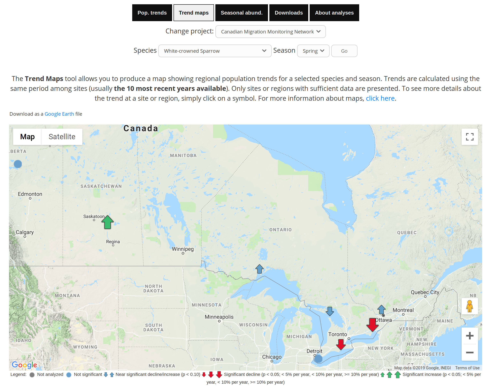
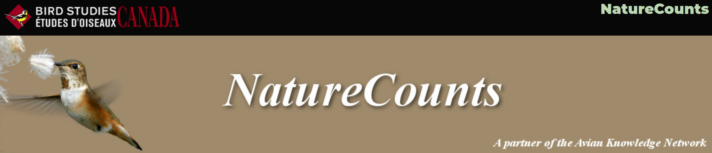

class: title-slide, nologo


```{r prep, include = FALSE}

```

.hanging[
### Stefanie E. LaZerte <br>& Denis Lepage]

# `naturecounts`

## a new R package to access standardized data on plant and animal populations

.spacer[ ]

<https://github.com/BirdStudiesCanada/naturecounts>  

.spacer[ ]

CRSC 2019

.align-bottom-left[  @steffilazerte  steffilazerte  sel@steffilazerte.ca]


---
# NatureCounts.ca

## Online repository
- Data stored in a standardized format
- 128 million occurrence records (>400 sources)
- 12,000 dataset requests
- 2.3 billion total record requests by 1850 users

## Goals
1. Safely archive data
2. Facilitate data entry into repository
3. Facilitate data access
4. Develop tools for exploration, analysis,   
  interpretation, and decision support




---
# `naturecounts`

.pull-left[

## R package
- Access raw data (dataframe, database)
- Access metadata (species taxonomy, etc.)
- Data formating (dates, zero-fill)
- Quick and reproducible

## Users
- Sign up on NatureCounts.ca (basic access)
- Request access to other datasets

## Development Status
- **Download tools**: Alpha
- **Data tools**: In Development
]


.pull-right[

## Basic Usage

```{r, eval = FALSE}
library(naturecounts) 

# Find species id
species_search(name = "Northern Cardinal")

# Download to dataframe
cardinals <- nc_data_dl(species = 19360, 
                        username = "sample")

# Download to SQLite Database
cardinals <- nc_data_dl(species = 19360, 
                        sql_db = "cardinals",
                        username = "sample")
```

.small[
## Package Source
<https://github.com/BirdStudiesCanada/naturecounts>  

## Support (Tutorials, Examples)
<https://birdstudiescanada.github.io/naturecounts/>
]
]


