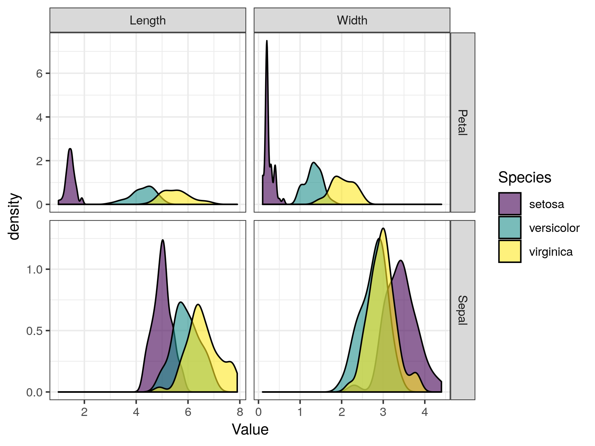

class: title-slide, nologo, nobar


```{r prep, include = FALSE}
library(tidyverse)
library(knitr)
library(here)

opts_chunk$set(echo = FALSE, cache = FALSE, dpi = 300,
               out.extra = "class = 'fig-right'", fig.width = 3.5,
               fig.height = 3.75)

hook_output <- knit_hooks$get("output")
knit_hooks$set(output = function(x, options) {
  extra <- options$extra
  
  if(is.null(extra)) {
    return(hook_output(x, options))  # pass to default hook
  }
  x <- hook_output(x, options)
  if(any(extra == "squish")) x <- paste0("\n.narrow[", x, "]")
  if(any(extra == "pause")) x <- paste0("--\n", x)
  x
})

theme_pres <- theme_bw() +
  theme(axis.title.x = element_blank(),
        legend.position = "top", legend.background = element_blank(),
        legend.margin = margin(),
        legend.box.margin = margin(),
        legend.box.spacing = unit(c(2,0,0,0), units = "pt"),
        plot.margin = unit(c(0, 0, 0, 5), units = "pt"))

```


### Symposium


# R pour ornithologue

### .rblue[Points de vue des utilisateuRs aux les programmeuRs]


# R for Ornithologists

### .rblue[Perspectives from useRs to programmeRs (to birdeRs)]


**10:30-14:15**  Salle des Plaines II


.footer[SCO-SOC 2019]

???
Ornithologists “in the era of new technologies” have access to ever increasing
sources of data, which in turn leads to large quantities of data. This wealth of
data is exciting, but sometimes overwhelming, and with new technologies for
collecting data, we need new technologies for processing and analyzing data. One
such technology is the free and open source programming language, R. R is a
powerful (and economical) tool that is highly extensible through ‘packages’ for
performing specific tasks. Because there are so many packages, many
ornithologists are not aware of the many ways in which R can be useful, or which
packages are available for purposes beyond statistical analysis. However, there
are numerous packages which have been developed for specific scientific, or even
ornithological applications. Such examples include those for accessing relevant
online data sources (e.g., climate data, eBird, population data, etc.), genomic
analyses, bioacoustic analyses, analyses of animal movements, reproducible
research workflow, and dissemination (e.g., graphs, maps, and interactive
visualizations). This presentation will introduce ornithologists to these tools
which make ornithological research quicker, easier, more affordable, and
stronger.

---
class: title-slide, nologo, nobar


.hanging[
### Stefanie E. LaZerte]


# R pour ornithologues
### Comment R profite à l'étude de l'ornithologie


---
# Qu’est-ce que c’est que R?

--

## Un langage de programmation statistique
(Source libre et ouverte!)

--

## R utilise des packages

- Les packages étendent R (i.e. `nlme` and `lme4 `modèles à effets mixtes)
- Les packages peuvent être écrits par n'importe qui  

- Certains vont bien, d'autres sont géniaux, d'autres sont INCROYABLES!
- .rblue[R Base] est R sans packages supplémentaire (aussi bon)

> Il y a des milliers de packages!

---
background-image: url(`r "./Figures/R_hard.png"`)
background-position: right 15% bottom 10%
background-size: 70%

# R est difficile

---
background-image: url(`r "./Figures/impostR.png"`)
background-position: center center
background-size: 70%

# Impost**R** Syndrome

---
background-image: url(`r "./Figures/impostR.png"`)
background-position: right 75px top 23%
background-size: 30%

# Impost**R** Syndrome


--


---
background-image: url(`r "./Figures/impostR.png"`)
background-position: right 75px top 23%
background-size: 30%

# Impost**R** Syndrome


**Using R in the undergraduate biology classroom**: Hurdles, hints, and aha moments  
(.rblue[Ici @ 13:45pm])


---
background-image: url(`r "./Figures/owl_computer.jpg"`)
background-position: right 75px bottom 125px
background-size: 45%

# Ornithologues et R

## Ce que je **ne vais pas** faire

- Vous enseigner R
- Parler de statistiques

--


## Ce que je **vais** faire

- Expliquer comment R peut profiter   
  aux ornithologues
- Présenter des packages utiles
- Vous donner des ressources pour   
  commencer

--
- Vous inspirer à prendre votre .rblue[R] au prochain niveau!

---
background-image: url(`r "./Figures/R_powerful2_edit.png"`)
background-position: center bottom 40%
background-size: 70%

# Pourquoi les ornithologues devraient utiliser R

## R est puissant!

---
# Pourquoi les ornithologues devraient utiliser R
## R est puissant!


**The blessing and curse of automated data collection:**  
  R and dealing with big data in a modern age  
  (.rblue[Ici @ 10:45])


**Super-computing with R:**  
  Harnessing the power of the cloud to analyze big-bird-data, or just run your simulations, models, and cross-validations faster  
(.rblue[Ici @ 11:15])

---
# Pourquoi les ornithologues devraient utiliser R
## Science reproductible

- Les scripts sont des enregistrements de votre travail   

```{r eval = FALSE, echo = TRUE}
m <- lm(mpg ~ cyl, data = mtcars)
summary(m)
```

--

- Les scripts peuvent être compilés dans des rapports pdf / html avec [**`rmarkdown`**](https://rmarkdown.rstudio.com/) et [**`knitr`**](https://yihui.name/knitr/)  
  (RStudio: `File > Compile Report`)


---
# Pourquoi les ornithologues devraient utiliser R
## Science reproductible

- Gardez une trace du code ET  
  de la sortie


--

- Garder une trace des données


--
- Garder une trace du logiciel


---
# Pourquoi les ornithologues devraient utiliser R

## Trouver des données!

- De nombreuses sources de données en ligne sont accessibles via R
- La science reproductible inclut le suivi des sources de données!

--

### Packages
- Observations de [ebird](https://ebird.org) avec [**`auk`**](https://github.com/CornellLabofOrnithology/auk)


--
- Observations de [NatureCounts](https://naturecounts.ca) avec [**`naturecounts`**](https://github.com/birdstudiescanada/naturecounts) (.rblue[Ici @ 11:00])

--
- Enregistrements de vocalisations de [xeno-canto](https://www.xeno-canto.org/) avec [**`warbleR`**](https://github.com/maRce10/warbleR)


--
- Données météorologiques de [Environnement et Changement climatique Canada](http://climate.weather.gc.ca/)  
  avec [**`weathercan`**](https://github.com/ropensci/weathercan)


--
- Séquences d'ADN de [GenBank](https://www.ncbi.nlm.nih.gov/genbank/) avec [**`phylotaR`**](https://github.com/ropensci/phylotaR)


--
- Données taxonomiques avec [**`taxize`**](https://github.com/ropensci/taxize)

--
- Liste rouge de l’UICN avec [**`rredlist`**](https://github.com/ropensci/rredlist)

???
- brranching: Includes methods for fetching 'phylogenies' from a variety of sources, including the 'Phylomatic' web service (<http://phylodiversity.net/phylomatic>), and 'Phylocom' (<https://github.com/phylocom/phylocom/>).
- Data published on [dryad](https://datadryad.org/) with [**`rdryad`**](https://github.com/ropensci/rdryad)

---
# Pourquoi les ornithologues devraient utiliser R
## Traitement des données


--


---
class: split-50
# Pourquoi les ornithologues devraient utiliser R

.columnl[
## Traitement des données
- Science reproductible!
- Nettoyage
  - Corriger les fautes de frappe
  - Trouver/Corriger des valeurs manquantes/impaires
- Filtration
- Résumant
- Transformation
- Exploration
]

--

.columnr[
## Packages à utiliser
- Base R (i.e. pas de packages spéciaux)
- [`data.table`](http://r-datatable.com) (<http://r-datatable.com>)
- [`tidyverse`](http://tidyverse.org) (<http://tidyverse.org>)
  - Collection de packages
  - Apprendre encore plus: [Anglais: R for Data Science](https://r4ds.had.co.nz/); [Français: Data Science avec R](https://bookdown.org/fousseynoubah/dswr_book/)

]


???
I don't know about you, but I've never come back from the field and thought, great, my data is perfectly ready for analysis.

---
# Pourquoi les ornithologues devraient utiliser R

## Des centaines de packages spécialisés

### Par exemple...

--
- Des analyses phylogénétiques comparatives [**`adephylo`**](https://github.com/thibautjombart/adephylo)

--
- Analyses bioacoustiques avec [**`seewave`**](http://rug.mnhn.fr/seewave/)


--
- Détection automatique des vocalisations avec [**`monitoR`**](http://www.uvm.edu/rsenr/vtcfwru/R/?Page=monitoR/monitoR.htm)

--
- Domaines vitaux d'un animal avec [**`adehabitatHR`**](https://cran.r-project.org/web/packages/adehabitatHR/)

--
- Modélisation bayésienne hiérarchique des données du Relevé des oiseaux nicheurs avec [**`bbsBayes`**](https://github.com/BrandonEdwards/bbsBayes)  (.rblue[Ici @ 11:30])


--
- Revues systématiques avec [**`litsearchr`**](https://elizagrames.github.io/litsearchr/) (.rblue[Ici @ 13:30])


???
- Animal movements detected by RFID with [**`feedr`**](https://github.com/animalnexus/feedr)

---
```{r ggplot2, include = FALSE, fig.asp = 0.75, fig.width = 6, dpi = 300, fig.align="right", fig.path = here("./2019-08 SOC - R Symposium/Figures/")}
library(tidyverse)

iris %>%
  gather(Measure, Value, -Species) %>%
  separate(Measure, into = c("Type", "Measure"), convert = TRUE) %>%
 ggplot(aes(x = Value, fill = Species)) +
    facet_grid(Type ~ Measure, scales = "free") +
    geom_density(alpha = 0.6) +
    theme_bw() +
    scale_fill_viridis_d()
```

# Pourquoi les ornithologues devraient utiliser R

## Dissémination et visualisations

- Belles figures avec [**`ggplot2`**](https://ggplot2.tidyverse.org/)




--
- Cartes complexes avec [**`sf`**](https://r-spatial.github.io/sf/), [**`tmap`**](https://github.com/mtennekes/tmap)


--
- Visualisations interactives avec [**`shiny`**](https://shiny.rstudio.com/)


---
# Pourquoi les ornithologues devraient utiliser R
## Trouver plus de packages!

- Liste non exhaustive!
- Collections de packages
   - [metaverse](https://rmetaverse.github.io/) (<https://rmetaverse.github.io/>)
   - [ropensci](https://ropensci.org/) (<https://ropensci.org/>)
   - [tidyverse](https://tidyverse.org/) (<https://tidyverse.org/>)
- Ressources pour les francophones <https://github.com/frrrenchies/frrrenchies>
- Rechercher dans les journaux, i.e. Methods in Ecology and Evolution
- Rechercher dans les sections de méthodes des articles

--


> Citez toujours les packages et leurs versions!

---
# **Symposium:** R pour Ornithologues

### Restez à l'écoute pour 6 autres présentations liées au .rblue[R]
### 14:00 Table ronde sur les perspectives ornithologiques sur la .rblue[R]


--


# .rblue[Merci!]


.footer-right[Compilé le `r Sys.Date()`]

.footer[
Présentation disponible: <https://steffilazerte.github.io/Presentations/>  
Diapositives créées avec le package [xaringan](https://github.com/yihui/xaringan), avec [remark.js](https://remarkjs.com), [knitr](http://yihui.name/knitr), et [R Markdown](https://rmarkdown.rstudio.com)]
