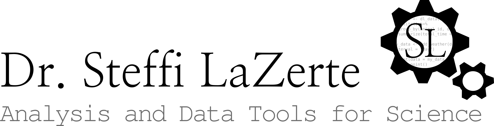
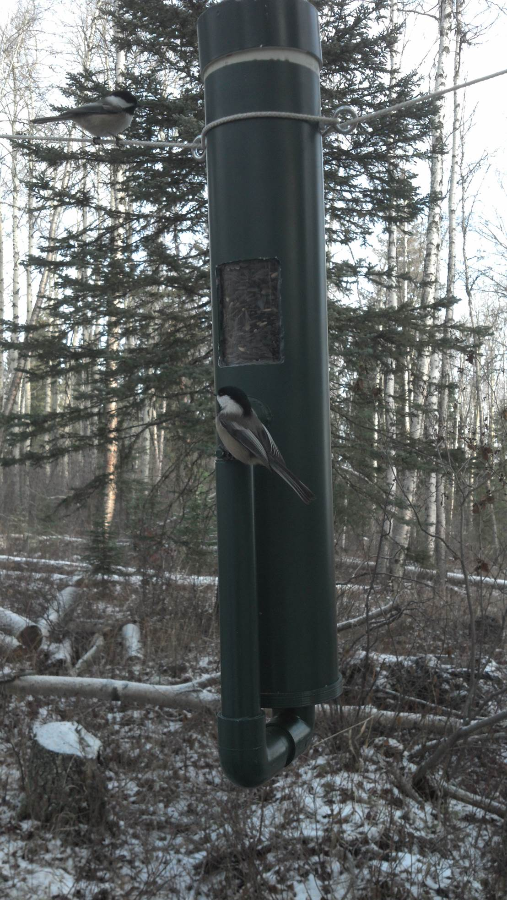
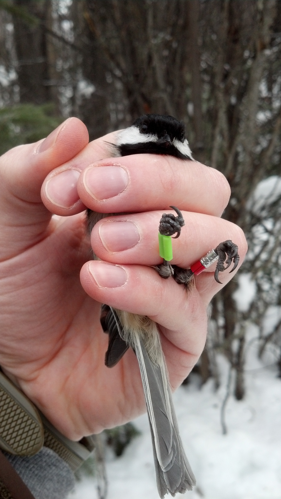
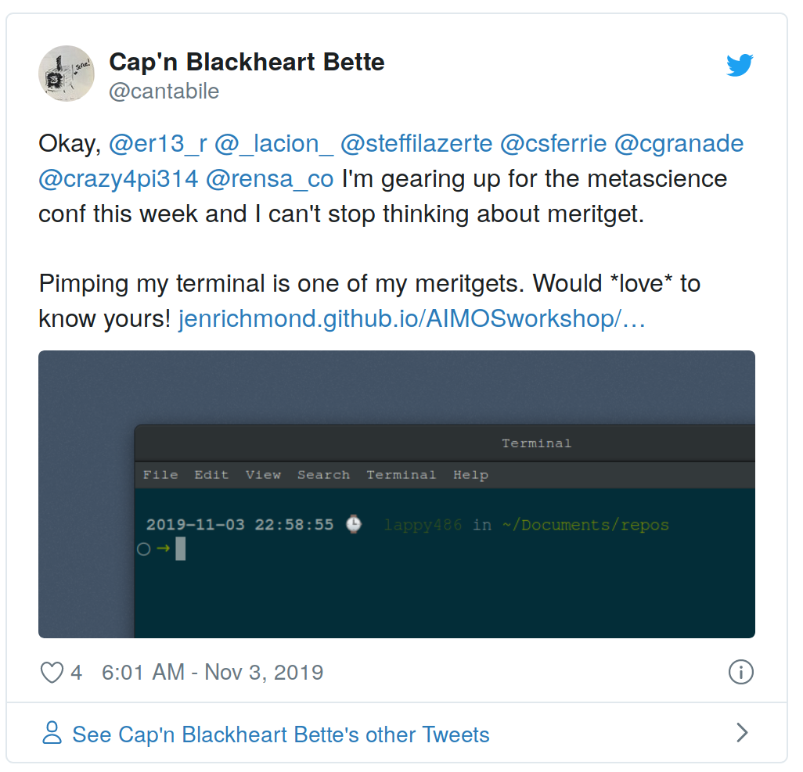
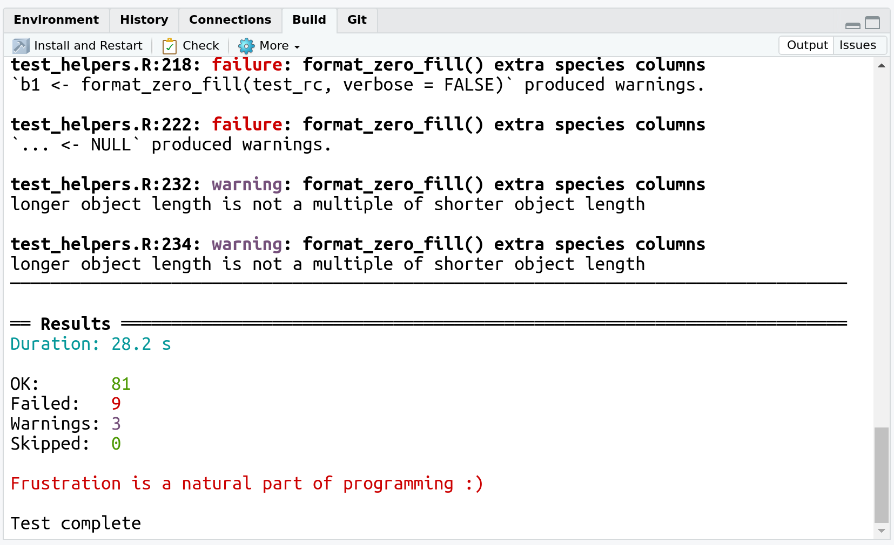
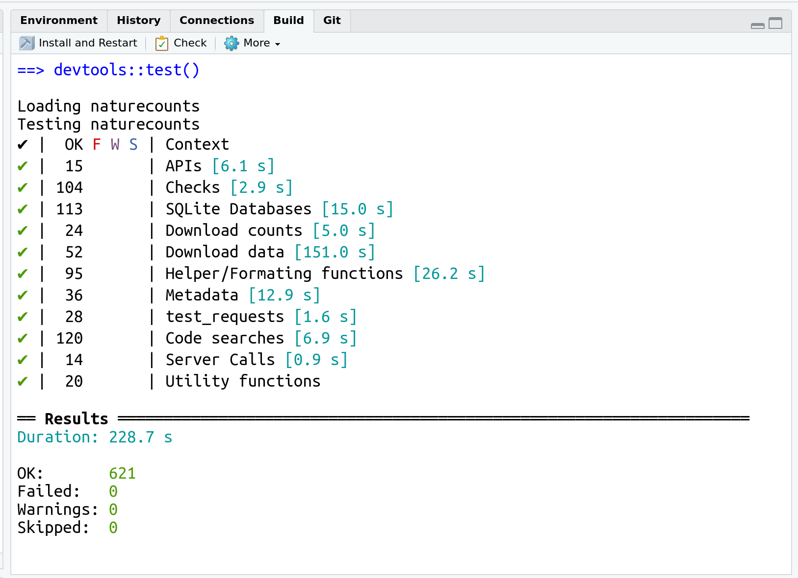
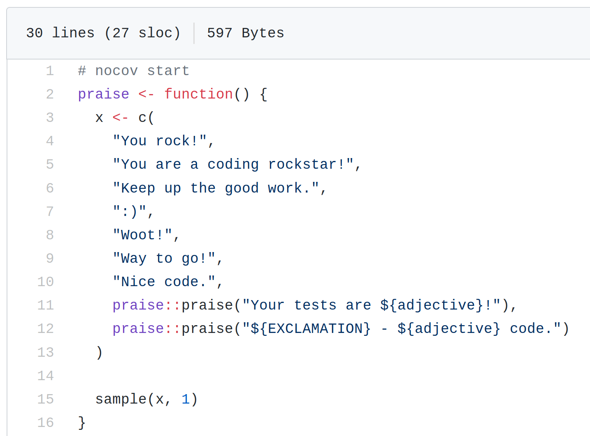
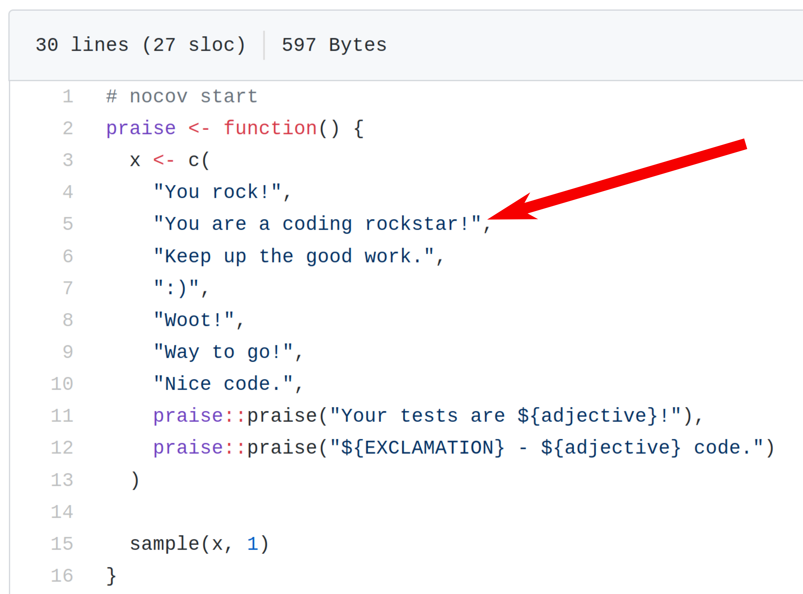
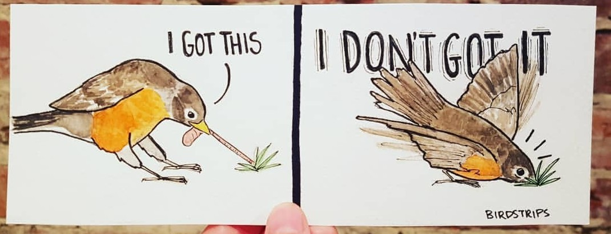
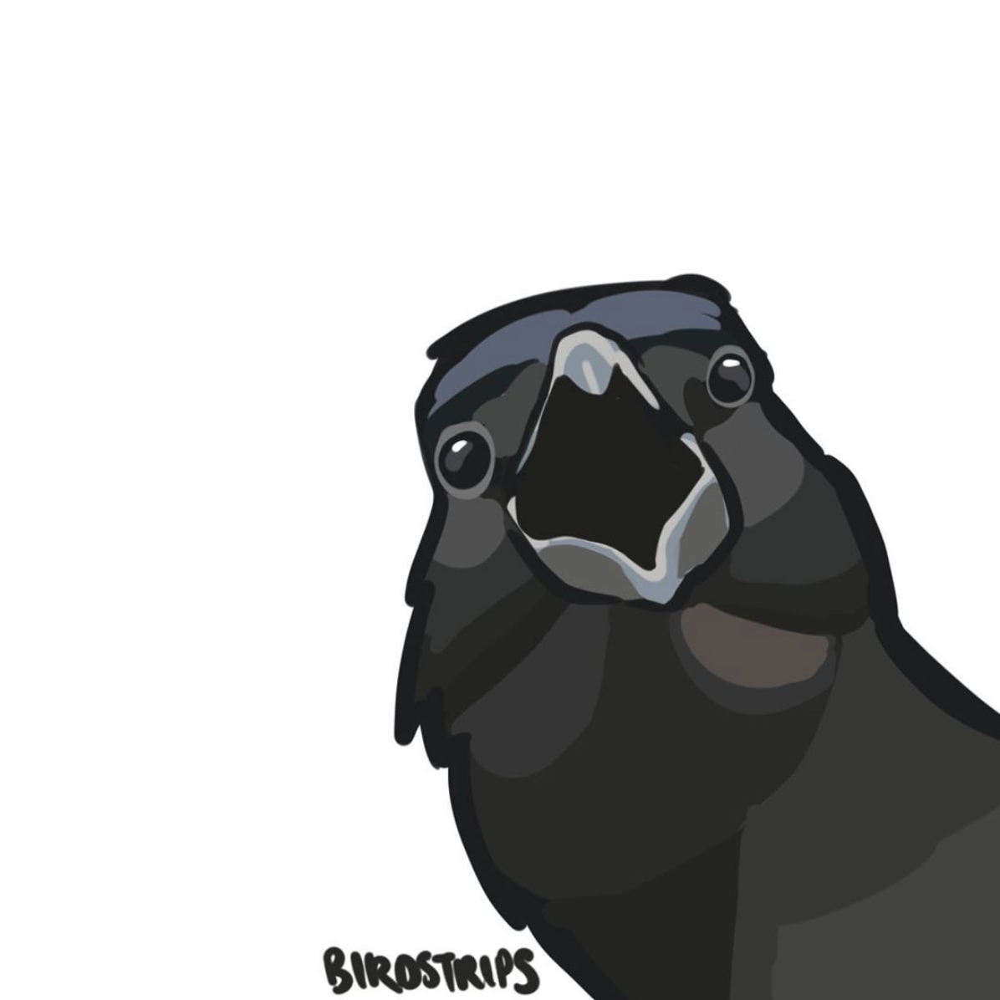

class: title-slide, nologo, nobar


```{r prep, include = FALSE}
library(tidyverse)
library(knitr)
library(here)

opts_chunk$set(echo = FALSE, cache = FALSE, dpi = 300,
               out.extra = "class = 'fig-right'", fig.width = 3.5,
               fig.height = 3.75)

hook_output <- knit_hooks$get("output")
knit_hooks$set(output = function(x, options) {
  extra <- options$extra

  if(is.null(extra)) {
    return(hook_output(x, options))  # pass to default hook
  }
  x <- hook_output(x, options)
  if(any(extra == "squish")) x <- paste0("
.narrow[", x, "]")
  if(any(extra == "pause")) x <- paste0("--
", x)
  x
})

theme_pres <- theme_bw() +
  theme(axis.title.x = element_blank(),
        legend.position = "top", legend.background = element_blank(),
        legend.margin = margin(),
        legend.box.margin = margin(),
        legend.box.spacing = unit(c(2,0,0,0), units = "pt"),
        plot.margin = unit(c(0, 0, 0, 5), units = "pt"))

```


<!-- .hanging[ -->
<!-- ### Stefanie E. LaZerte] -->





# Last Night, Testing Saved my Life
### Experiences of a biologist


---
# My Goals

.center[**How I hope you'll feel about testing**]


???
My experiences: I.e. Not a computer programmer! Learned a bit piecemeal, this always learning new things, definitely not an expert.

---
# Different Kinds of Testing

 (According to Steffi)

## Due Diligence (Data-testing)
- Double checking output as part of an analysis
- Sometimes interactive only
- Sometimes Rmd Report for posterity (and reproducibility)

--

## Automated Package Tests
- Rigorous, repeated, and automatic tests of package functionality
- Often local **and** remote (i.e. CRAN, Travis Ci, AppVeyor, [R-hub](https://builder.r-hub.io/))


> For this talk, **Testing = Automated Package Tests**

---
# Why I Started Testing

## Post-Doc on RFID project
- Summarize RFID data 
  - Movement between feeders
  - Time spent at a feeder
  - etc.
- Started with small scripts
- Created my first package ([`feedr`](https://github.com/animalnexus/feedr)!)



.footer-right[Jacob Bailey]


--

## But!
- My colleagues trusted me too much
- Package was getting big and worrisome
  - Mistakes
  - Breaking old code as adding new code


???
About 4 years ago got a post-doc to 

---
class: split-75
# How I Started Testing

.columnl[
- Hadley's "R packages" book chapter on Testing*
- Used [`testthat`](https://github.com/r-lib/testthat) package
- Series of test files (e.g., `test_utils.R`) in `tests/testthat` folder

.footer[*Now [2nd edition by Hadley Wickham and Jennifer Bryan](https://r-pkgs.org/)]
]

--

.columnl[


```{r, eval = FALSE, echo = TRUE}
test_that("check_normals() takes 'YYYY-YYYY'", {
  expect_silent(check_normals("1981-2010"))
  expect_error(check_normals("1981 2010"), "text string in the format")
  expect_error(check_normals("1981/2010"), "text string in the format")
  expect_error(check_normals(1981), "text string in the format")
})
```

]

--

.columnl[
- Automatically run by processes that build the package
 - R CMD CHECK, CRAN, [R-hub](https://builder.r-hub.io/)
 - Travis CI, AppVeyor

]


---
class: split-50
# Why I Keep Testing
## `meritget`



--


.columnl[
> A reward you get that has no value beyond the fact that it's a reward!
]

???
I recently learned what a meritget is from Charles Gray on twitter. And although I'm still a bit hazy, I'm pretty sure it is a reward you get, that has no value, beyond the fact that it's a reward and therefore makes you feel better. I think it comes from the achievements you can unlock in most video games these days.

---
# Why I Keep Testing
## `meritget`



???
I love the little pep-talk messages I get when testing

---
# Why I Keep Testing
## `meritget`



--


???
I love the little pep-talk messages I get when testing

---
# Why I Keep Testing
## `meritget`



.footer[<https://github.com/r-lib/testthat/blob/master/R/praise.R>]

--



---
# Why I Keep Testing

> "Testing your code can be painful and tedious, but it greatly increases the quality of your code"  
>   .small[*`testthat` README on GitHub*]


.center[
Too many times I thought:  


.medium[**I don't need to test that, it couldn't have broken anything!**]
]
--


.center[
and was so very very wrong!
]

---
class: space-list
# Why I Keep Testing

## Problem solving
- Took over development of a package
  - No tests to start, but really helpful to add tests as I made changes
- Bug fixing
  - Writing tests to check that bug fixes worked

--

## Organization
- I use `testthat` tests even for long-running local tests that don't run remotely
  - Keeps me organized
- Test systematically for weird/unexpected input 
  - Make sure messages/warnings/errors show up where they should

???
Sometimes the logic of a function gets a bit complex, so it can be useful 
to have simple tests to make sure different situations are clearly dealt with

---
class: space-list
# Why I Keep Testing

## Remote Testing
- Testing packages on other operating systems
  - Travis Ci, AppVeyor, [R-hub](https://builder.r-hub.io/)


--


---
class: space-list
# Why I Keep Testing

## Remote Testing
- Testing packages on other operating systems
  - Travis Ci, AppVeyor, [R-hub](https://builder.r-hub.io/)
- Using CRON scheduling on Travis Ci to check on and catch changing data sources  
  - e.g., run tests every couple of weeks for [`weathercan`](https://github.com/ropensci/weathercan)


---
# Problems with Testing

## Testing tests??!?!!
- Trouble shooting tests can take time
- Sometimes need to create special (small) datasets for testing (speed up testing)
- Sometimes complex operations take time to figure out how to test




---
class: space-list

# Problems with Testing

## Where it's hard to use it
- Difficult with shiny apps
  - But see: [`shinytest`](https://github.com/rstudio/shinytest), [`RSelenium`](https://github.com/ropensci/RSelenium)
- Difficult where credentials are needed
  - There are ways of adding credentials to online test suites
  - Create sample accounts with open credentials
  - Test secured credentials locally



.footer[[Birdstrips on Instagram](https://www.instagram.com/birdstrips)]

---
class: split-70
# Final Tips

- Time consuming, but worth it!
- Start slowly
- Use a coverage metric (e.g., [codecov.io](http://codecov.io))
- Also test for wonky input
- Number test files so they run in order  
  - e.g., `test_01_base.R`, `test_02_main.R`
- Checkout the resources in this Community Call


.footer[[Birdstrips on Instagram](https://www.instagram.com/birdstrips)]

--


.columnl[
.center[
## .rblue[Thank you!]
]]


.footer-right[Compiled on `r Sys.Date()`]

.footer[
Presentation Available: <https://steffilazerte.github.io/Presentations/><br>
Slides created with the R package [xaringan](https://github.com/yihui/xaringan), using [remark.js](https://remarkjs.com), [knitr](http://yihui.name/knitr), and [R Markdown](https://rmarkdown.rstudio.com)<br><br>]
