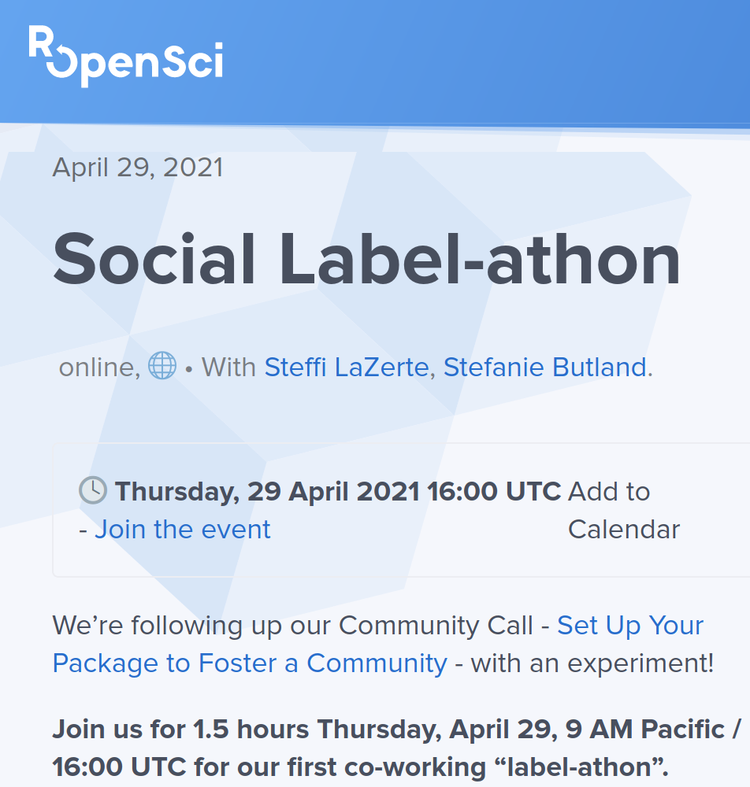
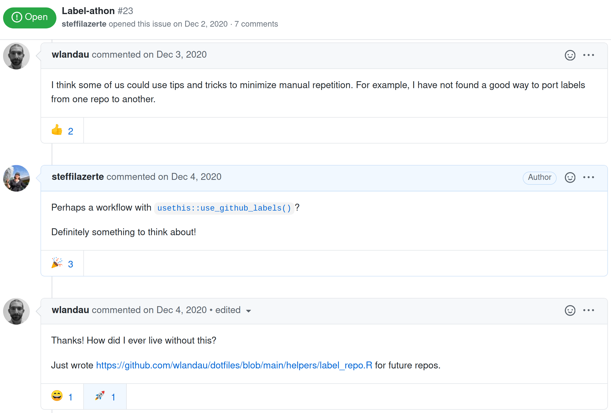

class: title-slide, nologo, nobar


```{r prep, include = FALSE}
library(tidyverse)
library(knitr)
library(here)

opts_chunk$set(echo = FALSE, cache = FALSE, dpi = 300,
               out.extra = "class = 'fig-right'", fig.width = 3.5,
               fig.height = 3.75)

hook_output <- knit_hooks$get("output")
knit_hooks$set(output = function(x, options) {
  extra <- options$extra

  if(is.null(extra)) {
    return(hook_output(x, options))  # pass to default hook
  }
  x <- hook_output(x, options)
  if(any(extra == "squish")) x <- paste0("
.narrow[", x, "]")
  if(any(extra == "pause")) x <- paste0("--
", x)
  x
})

theme_pres <- theme_bw() +
  theme(axis.title.x = element_blank(),
        legend.position = "top", legend.background = element_blank(),
        legend.margin = margin(),
        legend.box.margin = margin(),
        legend.box.spacing = unit(c(2,0,0,0), units = "pt"),
        plot.margin = unit(c(0, 0, 0, 5), units = "pt"))

```


.hanging[
### Steffi LaZerte]


# Set Up Your Package to Foster a Community
### Labelling issues


April 22, 2021

---
# My package's community took me by surprise!


<blockquote align = "center" class="twitter-tweet" data-cards="hidden"><p lang="en" dir="ltr"><a href="https://twitter.com/hashtag/rstats?src=hash&amp;ref_src=twsrc%5Etfw">#rstats</a> packages grow up so fast these days :)</p>&mdash; Alex K (@Alex_Koiter) <a href="https://twitter.com/Alex_Koiter/status/1380667063597989890?ref_src=twsrc%5Etfw">April 9, 2021</a></blockquote> <script async src="https://platform.twitter.com/widgets.js" charset="utf-8"></script> 


---
# Low-hanging fruit: Issue labels!

1\. **Why bother?**
- Users can be shy (esp. new users); "Help wanted" is an open invitation
- Labels can be searched
  - [All rOpenSci issues](https://github.com/search?q=org%3Aropensci++state%3Aopen&type=Issues)
  - ['Help wanted' rOpenSci issues](https://github.com/search?q=org%3Aropensci+label%3A%22help+wanted%22+state%3Aopen&type=Issues)
  
--

.spacer[]

2\. **rOpenSci Contributing Guide** -  [contributing.ropensci.org](https://contributing.ropensci.org/resources.html#issues)

--

.spacer[]


3\. **Let's Go** - [For example...](https://github.com/ropensci/weathercan)


--
.spacer[]

4\. **Who has the time?**
  - I'm terrible at this!

---
class: split-60
# rOpenSci Social Label-athon

.columnl[
.center[
**Thursday, 29 April 2021**  
**16:00 UTC / 9:00 Pacific** (1.5 hrs)  
Registration encouraged


.spacer[]

**Online social!**  
Co-working* to make our packages contributor-friendly

Code of Conduct? Contributing guide? Roadmap and expectations? 
Open and label issues to invite contributions?




.spacer[] 

**Afterwards, we'll tweet links to"help wanted" issues**
]

.footnote[
\* Working at the same time on our own projects  
<https://ropensci.org/events/labelathon01>]
]

---
# We can learn together!




---
# Social Experiment

.spacer[]

.center[**Experimental feature!**]

- Four label-athons (or more?)
- Alternating times to accommodate our community around the world
- **Thursdays April 29, May 13, May 27, June 10**

.spacer[]

.center[
**More Information:** <https://ropensci.org/events/labelathon01>

**Interested? [Please register!](https://form.jotform.com/210906095013043)**
]

--

.spacer[]

.center[
##Time for a poll!
]


