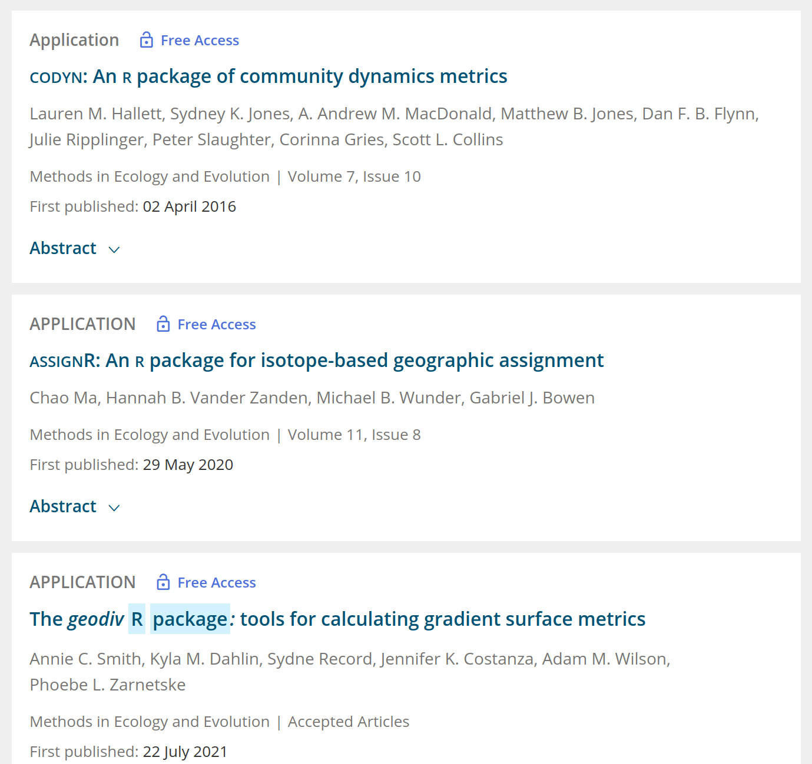
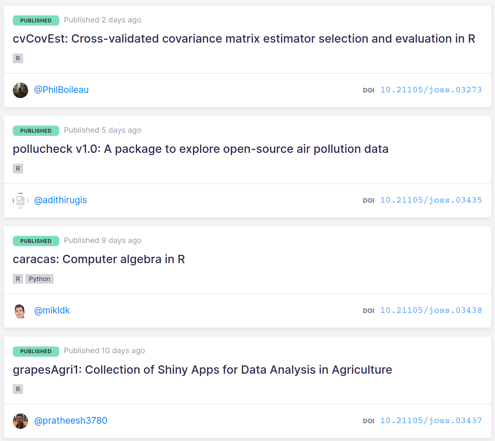

class: title-slide, nologo, nobar


```{r prep, include = FALSE}
library(tidyverse)
library(knitr)
library(here)
library(stringr)
library(icons)
library(glue)

opts_chunk$set(echo = FALSE, cache = FALSE, dpi = 300,
               out.extra = "class = 'fig-right'", fig.width = 3.5,
               fig.height = 3.75)

hook_output <- knit_hooks$get("output")
knit_hooks$set(output = function(x, options) {
  extra <- options$extra

  if(is.null(extra)) {
    return(hook_output(x, options))  # pass to default hook
  }
  x <- hook_output(x, options)
  if(any(extra == "squish")) x <- paste0("
.narrow[", x, "]")
  if(any(extra == "pause")) x <- paste0("--
", x)
  x
})

theme_pres <- theme_bw() +
  theme(axis.title.x = element_blank(),
        legend.position = "top", legend.background = element_blank(),
        legend.margin = margin(),
        legend.box.margin = margin(),
        legend.box.spacing = unit(c(2,0,0,0), units = "pt"),
        plot.margin = unit(c(0, 0, 0, 5), units = "pt"))


icon2 <- function(icon, title, icon_fun = ionicons) {
  icon <- icon_fun(icon)
  icon <- as.character(icon)
  if(str_detect(icon, '<title>')) {
    str_replace(icon, '<title></title>', glue('<title>{title}</title>')) %>%
      icons:::add_class('icon')
  } else {
    str_replace(icon,
                '(http://www.w3.org/2000/svg">
 )',
                  glue('\1<title>{title}</title>')) %>%
                    icons:::add_class('icon')
}
}

```


.hanging[
### Steffi LaZerte]


# **How can ornithologists find R packages?**
# **Comment les ornithologues peuvent-ils trouver des packages R?**


## Symposium: Great R packages for Ornithologists, AOS & SCO-SOC 2021


.footnote[
`r icon2('logo-twitter', 'Twitter')` @steffilazerte
`r icon2('logo-github', 'GitHub')` steffilazerte
`r icon2('globe-outline', 'World wide web')` steffilazerte.ca
]

???
Hi Everyone!  
I'm Steffi LaZerte from Brandon, Manitoba in Canada   
Welcome to our Lightning symposium: Great R packages for Ornithologists.   
I'm excited to get the ball rolling with "How can ornithologists find R packages?


---
# What is R?  |  Qu'est ce que R?


## A statistical programming language and environment
- Great for data management/manipulation (not just stats)
- Free and Open Source Software (FOSS)
- Almost infinitely extensible with packages


## Un environment et langage de programmation statistique
- Idéal pour la gestion/manipulation des données (pas seulement les stats)
- Source libre et ouvert
- Presque infiniment extensible avec des packages


--

.center[.large[**Sounds great! | Parfait!**]]

---
# Too many packages! | Trop de packages!


.center[.large[How can ornithologists find R packages?]]


.center[.large[Comment les ornithologues peuvent-ils trouver des packages R?]]

---
class: split-50
# Package collections | Collections de packages

.center[
### rOpenSci 
.small[(<https://ropensci.org>)]


.columnl[
### tidyverse 
.small[(<https://tidyverse.org/>)]
]


.columnr[
### metaverse 
.small[(<https://rmetaverse.github.io/>)]
]
]


???
rOpenSci is an organization that curates and performs software review of R packages for accessing data, and are now also branching out into reviewing statistical packages as well

tidyverse is a collection of R packages that work well together for manipulating/munging data

metaverse is a collection of R packages for metadata analysis

---
class: nobar, split-30

.columnl[]
.columnr[
<https://r-universe.dev>
.medium[**In development, soon with tags and categories!<br>
En développement, bientôt avec des tags et des catégories!**]
]


???
A related and relatively new platform is the R-universe by rOpenSci

Here, individuals or organizations can create their own "universes" which we can than
explore.

Important to note that this platform is still in development, and they're planing on 
adding other metrics, like tags or categories, which we'll be able to use to search 
for packages. So I'm really excited for when this becomes more mature.


---
class: split-50
# R Task Views

.columnl[
## Annotated collections of packages

- Browse on CRAN .small[(main network of R packages)]<br>.small[<https://cran.r-project.org/web/views/>]
- [Environmetrics](https://cran.r-project.org/web/views/Environmetrics.html), [Spatial](https://cran.r-project.org/web/views/Spatial.html), [Survival](https://cran.r-project.org/web/views/Survival.html), [Tracking](https://cran.r-project.org/web/views/Tracking.html)
]

.columnr[
## Collections annotées de packages
- Naviguez sur CRAN .small[(réseau principal de packages R)]<br>.small[<https://cran.r-project.org/web/views/>]
- [Environmetrics](https://cran.r-project.org/web/views/Environmetrics.html), [Spatial](https://cran.r-project.org/web/views/Spatial.html), [Survival](https://cran.r-project.org/web/views/Survival.html), [Tracking](https://cran.r-project.org/web/views/Tracking.html)
]


--


.large[**Stay tuned! | Restez à l'écoute!**]

> Symposium: Great R packages for Ornithologists
> 
> **Putting it all together: Ornithometrics — a task view for ornithology**
> 
> Marc-Olivier Beausoleil  
> Tuesday Aug 10th 11:05am Eastern


???
And even more relevant, we have Marc-Olivier Beausoleil talking in this symposium, about
his new Ornithometrics task view.

So I encourage you to check that out!

---
class: split-50
# Methods *journals* | *Journaux* de méthodes

.columnl[
### Methods in Ecology and Evolution
.small[<http://www.methodsinecologyandevolution.org/>]
]


.columnlr[
### Journal of Open Source Software
.small[<https://joss.theoj.org/>]
]



---
class: split-70
# Methods *sections* | *Sections* méthodes


![:img center, center, 40%, A screen shot of a paragraph from an articles methods section reading 'To determine whether the odds of being an atypical singer increased with urbanization&#44; we performed a logistic regression of male singer type (atypical/typical&rpar; against the urbanization index using R statistical software (version 3.3.2; R Core Team 2016&rpar;. We calculated bias-corrected and adjusted (BCa&rpar; bootstrap 95% CI for coefficients. We performed 10000 replicates using the boot package for R (version 1.3-20; Angelo and Ripley 2017&rpar;. Figures were created using the R package ggplot2 (version 2.2.1; Wickham 2009&rpar;. Spectrograms were created with Hanning window lengths of 1024 using the R packages ggplot2 and seewave (version 2.0.5; Sueur et al. 2008&rpar;.' The final two sentences are highlighted in bright yellow.](Figures/methods.png)


.footnote[.small[LaZerte et al. 2019. More Mountain Chickadees (*Poecile gambeli*) sing atypical songs in urban than in rural areas]]

--

.columnl[]


.columnr[

.center[What does this imply?<br>**Cite R packages you use!!!**]


.center[Qu'est-ce que cela implique?<br>**Citez les packages R que vous utilisez!!!**]
]

???
You should cite the R pacakges you use 

a) because it makes your work more reproducible, 

b) it give credit to the package authors and 

c) it makes it easier for your colleages to find new and cool packages as well!


---
# Methods *sections* | *Sections* méthodes


> Symposium: Great R packages for Ornithologists
> 
> **seewave and tuneR: Sound analysis in ornithology**
> 
> Sunny Tseng  
> Tuesday Aug 10th 10:17am Eastern


???
On that note, if I peaked your interest with the seewave package we have a talk in this symposium on Seewave and tuneR by Sunny Tseng

---
# Ask your colleagues! | Demandez à vos collègues!

.center[Don't code alone `r emo::ji("grin")` Ne code pas seul]

.center[Follow `#RStats` on Twitter | Suivez `#RStats` sur Twitter]


.footnote[Artwork|Oeuvre [@allisonhorst](https://twitter.com/allison_horst)]

???
Lastly, but definitely not least, ask your colleagues!

Coding alone is frustrating, and talking to others is a great way to get new ideas and learn about new packages.

If you're on twitter, follow the RSTATS hashtag, twitter has a great R community

---
# Ask your colleagues! | Demandez à vos collègues!

## In this symposium alone... | Dans ce seul symposium...

.small[
- **dplyr**: A useful toolbox for manipulating data
- **sf**, **raster**, and **tmap**: The spatial data trinity
- **osmdata**: Roadless areas and avian diversity,
- **seewave** and **tuneR**: Sound analysis in ornithology
- **warbler** and **Rraven**: Bioacoustics in R
- **soundecology**: Using acoustic indices for landscape assessment and monitoring
- **naturecounts**: Millions of bird occurrence records at your fingertips
- **bbsAssistant**: An R package for downloading and handling data and information from the North American Breeding Bird Survey
- **motus**: Managing motus data in R
- **track2KBA**: An R package for identifying important sites for biodiversity from tracking data
- **MixSIAR**: An R package for avian diet analysis
- **INLA**: A way for ecologists to overcome their worst impulses
- **pavo**: Color analysis in birds
- moult and **moultmcmc**: Inference for moult phenology models
]

.medium[
> 18 packages used by your colleagues... Who else has exciting things to share?<br>
> 18 packages utilisés par vos collègues... Qui d'autre a des choses passionnantes à partager?]

???
In this symposium alone there are 18 R packages that your colleagues are going to talk about. Just imagine who else might have something exciting to share?


---
class: split-50
# Take home | Conclusion


.columnl[
.align-right[
LOTS of packages for ornithologists!<br>
R is not just for Stats<br>
Cite the packages you use<br>
Don't code alone `r emo::ji("grin")`<br>
Ask your colleagues!
]]

.columnr[
BEAUCOUP de paquets pour les ornithologues!<br>
R n'est pas seulement pour les statistiques<br>
Citez les packages que vous utilisez<br>
`r emo::ji("grin")` Ne code pas seul<br>
Demandez à vos collègues!<br>
]


--


.columnl[
.align-right[
**Thanks to the [Software Sustainability Institute](https://www.software.ac.uk/about) for sponsoring this symposium!**
]]


.columnr[
**Merci au [Software Sustainability Institute](https://www.software.ac.uk/about)
d'avoir parrainé ce symposium!**
]


.columnr[

.small[
.center[

]]]

.footnote[
.small[
`r icon2('logo-twitter', 'Twitter')` @steffilazerte | `r icon2('logo-github', 'GitHub')` steffilazerte | `r icon2('globe-outline', 'World wide web')` steffilazerte.ca<br>
Slides: <https://steffilazerte.ca/presentations.html>; Created with the R package [xaringan](https://github.com/yihui/xaringan), using [remark.js](https://remarkjs.com), [knitr](http://yihui.name/knitr), and [R Markdown](https://rmarkdown.rstudio.com)<br>
Icons from [Ionicons](https://ionic.io/ionicons) and [Academicons](https://jpswalsh.github.io/academicons/); Compiled on `r Sys.Date()`]]


.footnote-right[
.small[
]]

<!--  -->


???

And I want to give a special thanks to the Software Sustainability Institute for
sponsoring this symposium

