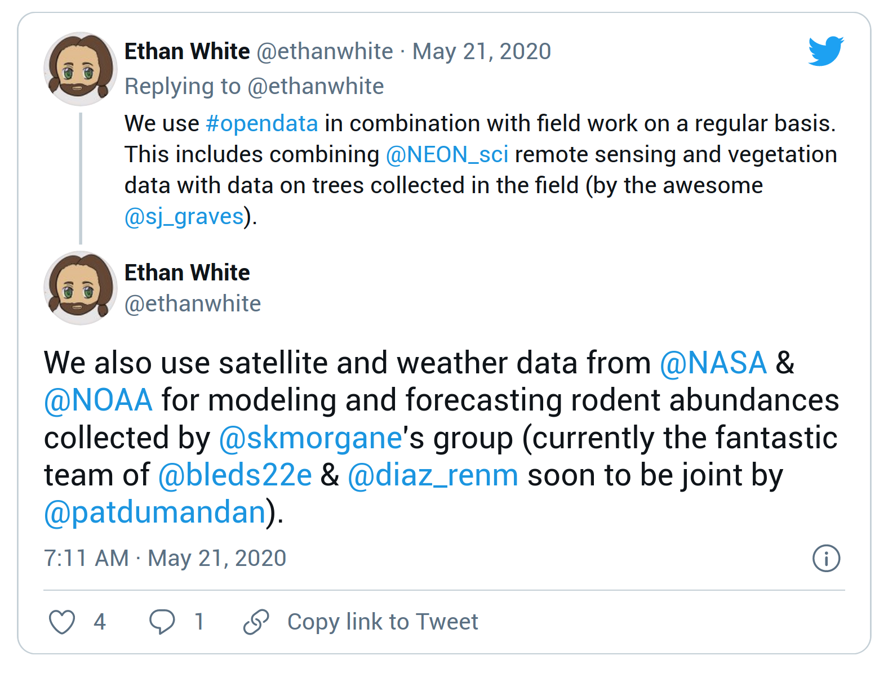
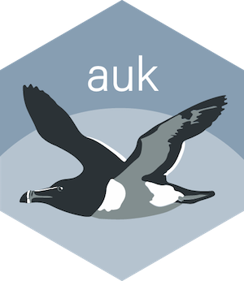
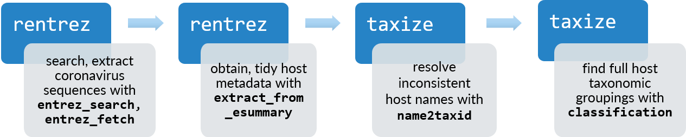

class: title-slide, nologo, nobar, split-50


```{r prep, include = FALSE}
library(tidyverse)
library(knitr)
library(here)
library(icons)
library(glue)

opts_chunk$set(echo = FALSE, cache = FALSE, dpi = 300,
               out.extra = "class = 'fig-right'", fig.width = 3.5,
               fig.height = 3.75)

hook_output <- knit_hooks$get("output")
knit_hooks$set(output = function(x, options) {
  extra <- options$extra

  if(is.null(extra)) {
    return(hook_output(x, options))  # pass to default hook
  }
  x <- hook_output(x, options)
  if(any(extra == "squish")) x <- paste0("
.narrow[", x, "]")
  if(any(extra == "pause")) x <- paste0("--
", x)
  x
})

theme_pres <- theme_bw() +
  theme(axis.title.x = element_blank(),
        legend.position = "top", legend.background = element_blank(),
        legend.margin = margin(),
        legend.box.margin = margin(),
        legend.box.spacing = unit(c(2,0,0,0), units = "pt"),
        plot.margin = unit(c(0, 0, 0, 5), units = "pt"))

icon2 <- function(icon, title, icon_fun = ionicons) {
  icon <- icon_fun(icon)
  icon <- as.character(icon)
  if(str_detect(icon, "<title>")) {
    str_replace(icon, "<title></title>", glue("<title>{title}</title>")) %>%
      icons:::add_class("icon")
  } else {
    str_replace(icon, 
                "(http://www.w3.org/2000/svg\">\n )", 
                glue("\\1<title>{title}</title>")) %>% 
      icons:::add_class("icon")
  }
}
```


.hanging[
### Stefanie E. LaZerte]


.medium[
**ESA 2021**  
INS 6: **Open Data Resources During a Global Pandemic**  
**Live Discussion**: Tuesday August 3 2021, 11am - 12pm Pacific
]


# Using rOpenSci packages to access open data for ecology


.footnote[
`r icon2("logo-twitter", "Twitter")` @steffilazerte   
`r icon2("logo-github", "GitHub")` steffilazerte
`r icon2("globe-outline", "World wide web")` steffilazerte.ca 
]

.footnote-right[
`r icon2("logo-twitter", "Twitter")` @rOpenSci
`r icon2("globe-outline", "World wide web")` rOpenSci.org
]


---
class: nobar, nologo


???
rOpenSci is an orgnaization, which, among other things curates a collection of peer-reviewed packages to support open data, open science and reproducibility

---
# Open data 


.center[
**We do this by**  

"Creating technical infrastructure in the form of carefully vetted,   
staff and community-contributed R software tools that  
**lower barriers to working with scientific data sources on the web**"]


.center[
### Open Data `r icon2("arrow-forward", "Right Arrow")` Open Science `r icon2("arrow-forward", "Right Arrow")` Better Science
]

???
- Large, global datasets can be unweildly, so
- Lowering barriers is important because we can have all the open data in the world, but
if scientists can't access them, it's moot

- I'm going to highlight some rOpenSci packages which can be used to access large, global datasets for ecological research in different situations


---
# Open data to study ecology

### Complement field data


<!-- For HTML Version: -->

<center>
<blockquote class="twitter-tweet"><p lang="en" dir="ltr">We also use satellite and weather data from <a href="https://twitter.com/NASA?ref_src=twsrc%5Etfw">@NASA</a> &amp; <a href="https://twitter.com/NOAA?ref_src=twsrc%5Etfw">@NOAA</a> for modeling and forecasting rodent abundances collected by <a href="https://twitter.com/skmorgane?ref_src=twsrc%5Etfw">@skmorgane</a>&#39;s group (currently the fantastic team of <a href="https://twitter.com/bleds22e?ref_src=twsrc%5Etfw">@bleds22e</a> &amp; <a href="https://twitter.com/diaz_renm?ref_src=twsrc%5Etfw">@diaz_renm</a> soon to be joint by <a href="https://twitter.com/patdumandan?ref_src=twsrc%5Etfw">@patdumandan</a>).</p>&mdash; Ethan White (@ethanwhite) <a href="https://twitter.com/ethanwhite/status/1263442365362077696?ref_src=twsrc%5Etfw">May 21, 2020</a></blockquote> <script async src="https://platform.twitter.com/widgets.js" charset="utf-8"></script>
</center>


<!-- For PDF Version: -->

<!--  -->


???
- This tweet was inspired by a rOpenSci blog post asking how scientists use open data in their work.  
- What you can see here is an example of using open data to complement ecological field work.   
- This works particularly well in ecology with data related to weather, soil and other large-scale landscape metrics.
- Specially in this example, Ethan's lab is using data from NASA and NOAA

---
class: split-60, space-list
# Open data to study ecology

### Complement field data


.footnote[.small[***rOpenSci blog** [POWER to the People](https://ropensci.org/blog/2019/05/14/nasapower/) by Adam Sparks]]

.columnl[
- **rnoaa: [NOAA](https://www.ncdc.noaa.gov/) weather, climate, tides, ice, etc.**   
   .small[(Scott Chamberlain, 2021)]

- **nasapower: [NASA POWER](https://power.larc.nasa.gov/) Global Meteorology, Surface Solar Energy and Climatology**  
  .small[(Adam Sparks, 2018)]
  
- **riem: Weather data from international airports via Iowa Environment Mesonet**   
  .small[(Maëlle Salmon, 2016)]

![:img right: 15px, bottom: 20%, 40%, Map of the earth in graded colours (no outlines) with the x axis showing longitude and the y axis showing latitude. The map runs from blue at the north to green to yellow at the equator back to green then blue and purple at the south representing annual average temperatures with yellow being the warmest and purple the coldest. The outlines of the continents and mountain ranges are just visible via slightly different colours reflecting different temperatures., , Global 30-year annual average temperature modelled from satellite data accessed via rnoaa<sup>*</sup>](https://d33wubrfki0l68.cloudfront.net/5540191f748c25a706bcf1b37132c4dfbb420f9b/c96cb/img/blog-images/2019-05-14-nasapower/global-t2m-1.png)

]

???
- and so it's great that rOpenSci has packages which can be used to access these kinds of data
- Large global datasets


---
class: space-list
# Open data to study ecology **during a pandemic**

### When field or lab work is not an option<sup>*</sup>


- **rgbif: Download taxonomy and occurrences from  [Global Biodiversity Information Facility](https://www.gbif.org/)**   
  .small[(Scott Chamberlain & Damiano Oldoni, 2021)]
  - all taxonomic groups
- **rinat: Download observations from `r icon2("inaturalist", "iNaturalist logo: black bird flying facing right", academicons)` [iNaturalist](https://www.inaturalist.org/)**   
   .small[(Vijay Barve, Edmund Hart & Stéphane Guillou, 2021)]
  - all taxonomic groups
- **auk: Manage observations from [eBird](https://ebird.org)**  
   .small[(Matthew Strimas-Mackey, Eliot Miller & Wesley Hochachka, 2018)]
  - avian observations
   
   

   
.footnote[.small[***rOpenSci blog** [When Field or Lab Work is not an Option - Leveraging Open Data Resources for Remote Research](https://ropensci.org/blog/2020/05/19/covid-19-open-data/) by The rOpenSci Team *et al.*

****rOpenSci use cases** [Mapping asian elephant observations with rgbif](https://discuss.ropensci.org/t/mapping-asian-elephant-observations-with-rgbif/2524) by Tuija Sonkkila]]


???
During this pandemic, field work is often not an option, but with rOpenSci packages research can continue as scientists take advantage of the massive amounts of open scientific data that are freely available.


---
class: space-list
# Open data to study ecology **of a pandemic**

### Explore how birds change their use of urban landscapes during a pandemic<sup>*</sup>


- Pandemic resulted in declines in human activity
- How does this affect use of urban areas by birds?
- Open data from eBird
- rOpenSci **auk** package to manage huge eBird data sets




.footnote[
.small[***Science Advances** Reduced human activity during COVID-19 alters avian land use across North America<br>
(accepted pending revisions) by Michael Schrimpf *et al.* ]]

---
# Open data to study ecology **of a pandemic**

### Explore how birds change their use of urban landscapes during a pandemic<sup>*</sup>


  


.footnote[
.small[***Science Advances** Reduced human activity during COVID-19 alters avian land use across North America<br>
(accepted pending revisions) by Michael Schrimpf *et al.* ]]

---
class: split-60, space-list
# Open data to study **a virus**

### Data on the coronaviruses<sup>*</sup>

- **rentrez: Search, download data from, and otherwise interact with NCBI databases**  
  .small[(David Winter, 2017)]
  
- **taxize: Search by species names for taxonomic hierarchical information**   
   .small[(Scott Chamberlain & Eduard Szocs, 2013)]
  

  


.footnote[.small[***rOpenSci blog** [Using Open-Access Tools (rentrez, taxize) to Find Coronaviruses, Their Genetic Sequences, and Their Hosts](https://ropensci.org/blog/2020/11/10/coronaviruses-and-hosts/) by Liam Brierley]]


???
- Disease Ecology
- Get genetic information
- Information on disease hosts


---
class: title-slide, nologo, nobar, split-50

### Open Data `r icon2("arrow-forward", "Right arrow")` Open Science `r icon2("arrow-forward", "Right arrow")` Better Science


# .rblue[Thank you!]


.columnl[

.small[
`r icon2("logo-twitter", "Twitter")` @steffilazerte   
`r icon2("logo-github", "GitHub")` steffilazerte
`r icon2("globe-outline", "World wide web")` steffilazerte.ca 
]]

.columnr[

.small[
`r icon2("logo-twitter", "Twitter")` @rOpenSci
`r icon2("globe-outline", "World wide web")` rOpenSci.org
]]


.footnote[
.small[
Compiled `r Sys.Date()`    
Available: <https://steffilazerte.ca/presentations><br>
Slides created with the R package [xaringan](https://github.com/yihui/xaringan), using [remark.js](https://remarkjs.com), [knitr](http://yihui.name/knitr), and [R Markdown](https://rmarkdown.rstudio.com)   
Icons from [Ionicons](https://ionic.io/ionicons) and [Academicicons](https://jpswalsh.github.io/academicons/)]

]
