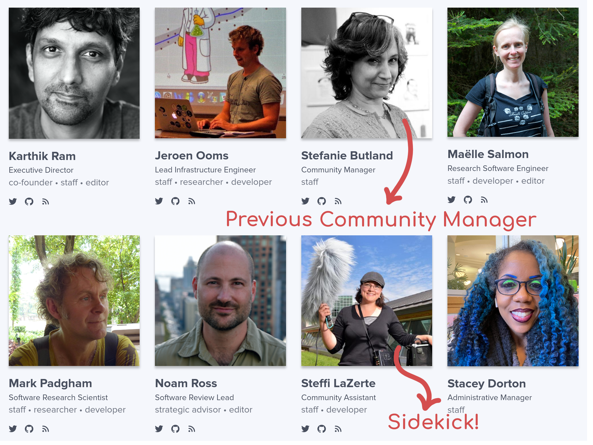

class: title-slide, nologo, nobar

<style> 
  h2 {
  font-weight: bold;
  }
</style>


```{r prep, include = FALSE}

library(tidyverse)
library(knitr)
library(here)
library(stringr)
library(icons)
library(glue)

opts_chunk$set(echo = FALSE, cache = FALSE, dpi = 300,
               out.extra = "class = 'fig-right'", fig.width = 3.5,
               fig.height = 3.75)

hook_output <- knit_hooks$get("output")
knit_hooks$set(output = function(x, options) {
  extra <- options$extra

  if(is.null(extra)) {
    return(hook_output(x, options))  # pass to default hook
  }
  x <- hook_output(x, options)
  if(any(extra == "squish")) x <- paste0("
.narrow[", x, "]")
  if(any(extra == "pause")) x <- paste0("--
", x)
  x
})

theme_pres <- theme_bw() +
  theme(axis.title.x = element_blank(),
        legend.position = "top", legend.background = element_blank(),
        legend.margin = margin(),
        legend.box.margin = margin(),
        legend.box.spacing = unit(c(2,0,0,0), units = "pt"),
        plot.margin = unit(c(0, 0, 0, 5), units = "pt"))


icon2 <- function(icon, title, icon_fun = ionicons) {
  icon <- icon_fun(icon)
  icon <- as.character(icon)
  if(str_detect(icon, '<title>')) {
    str_replace(icon, '<title></title>', glue('<title>{title}</title>')) %>%
      icons:::add_class('icon')
  } else {
    str_replace(icon,
                '(http://www.w3.org/2000/svg">
 )',
                  glue('\1<title>{title}</title>')) %>%
                    icons:::add_class('icon')
}
}

```

### Exploring rOpenSci

## Learning more, getting involved


.footnote-right[
`r icon2('logo-twitter', 'Twitter')` @steffilazerte | `r icon2('logo-github', 'GitHub')` steffilazerte | `r icon2('globe-outline', 'World wide web')` steffilazerte.ca
]


---
class: nobar
background-image: url("Figures/office.jpg")
background-size: cover
background-position: center

# **This is me!**

---
class: nobar


# .black[**These are my creatures**]

---
class: nobar


# **This is my garden**

---
# **This is my work***


.footnote[.small[(* On, with, and for)]]


---
# **This is my work***


.footnote[.small[(On, with, and for)]]


---
# What about you?

- Who are you?
- Who are your creatures? (human, animal, plant, mineral)
- What is your work?

(Answer as many as you feel like sharing `r emo::ji("wink")`)

--


> Great! Onwards...

---
# What is rOpenSci?


???
rOpenSci is a non-profit initiative founded in 2011. We create technical and community infrastructure for open and reproducible research in the R language. This includes a curated collection of over 300 R packages, a software peer review system, the R-universe platform for building, testing, and publishing packages, and documentation community engagement programs to support scientific R developers.


---
# What is rOpenSci?


---
# What is rOpenSci?


---
# What is rOpenSci?


--




--


---
class: space-list
# Packages!


- Community contributed 
  - .medium[[Submit a package!](https://ropensci.org/software-review/)]  
  
  
--

- Formally peer-reviewed 
  - .medium[[Volunteer to be a reviewer!](https://contributing.ropensci.org/resources.html?q=review#devguide)]
  - Recently added *Statistical*<br>software peer-review  
  
  
---
class: space-list
# Packages!

> **Lots of packages!**
> 
> - Go to <https://ropensci.org/packages>
> - Take a couple of minutes to look for packages which might be relevant
> - What did you find?
>   - Anything surprising? Anything new?

---
class: space-list
# Packages!


- Community contributed 
  - .medium[[Submit a package!](https://ropensci.org/software-review/)]  

- Formally peer-reviewed 
  - .medium[[Volunteer to be a reviewer!](https://contributing.ropensci.org/resources.html?q=review#devguide)]
  - Recently added *Statistical*<br>softare peer-review

- Optional workflow for<br>submitting to journals
  - .medium[Journal of Open Source Software]
  - .medium[Methods in Ecology and Evolution]
  
  
--

- Use packages!
  - Cite them
  - Submit usecases to [forum](https://discuss.ropensci.org/c/usecases/10)


---
class: section, nobar

# Seriously... cite R and R packages!

---
# Citing R and R packages

## Why cite?

> **Activity**
>
> (5 min) In small groups discuss: 
> 
>  - Why cite R and R packages?


---
# Citing R and R packages

## Why cite?

- Developer Credit
- Repeatable Science
  - .small[Not the same as *reproducible*]
- Gratitude

--

## Which packages?


> **Activity**
>
> (5 min) In small groups discuss: 
> 
>  - Which packages should you cite?
>    - All of them?
>    - If only some, which? How do you pick?

---
# Citing R and R packages

## Why cite?

- Developer Credit
- Repeatable Science
  - .small[Not the same as *reproducible*]
- Gratitude

## Which packages?

- Tricky!
- FORCE11 SCIWG:  "Software important to the research outcome"<sup>*</sup>
- Steffi: As above and as much as you can reasonably include
  - .small[Remember developer credit!]


.footnote[\* FORCE11 Software Citation Implementation Working Group]


---
# Citing R and R packages

## How to cite R?

### Bibliography

```{r, echo = TRUE}
citation()
```


---
# Citing R and R packages

## **How to cite R?**

### In text
```{r, echo = TRUE}
version$version.string
```


> "All analyses were performed using R Statistical Software 
> (v4.1.2; R Core Team 2021)"

---
# Citing R and R packages

## How to cite R packages

### Bibliography

```{r, echo = TRUE}
citation("car")
```


---
# Citing R and R packages

## How to cite R packages

### In text
```{r, echo = TRUE}
packageVersion("car")
```

> "All analyses were performed using R Statistical Software (v4.1.2; R Core Team 2021). 
> Type III ANOVAs were calculated using the car R package 
> (v`r packageVersion("car")`; Fox and Weisberg 2019)."


<!-- --- -->
<!-- # Citing R and R packages -->

<!-- ## Your Turn! -->

<!-- > Pick an R package you're using in your final project -->
<!-- >  -->
<!-- > Use `citation()` and `packageVersion()` to figure out how to cite -->
<!-- > this package in your **bibliography** and in the **text**. -->

--

## More?

For more details, see my blog post on rOpenSci: [How to Cite R and R Packages](https://ropensci.org/blog/2021/11/16/how-to-cite-r-and-r-packages/)


---
class: section, nobar

# Back to rOpenSci

## Community!

---
class: space-list

# Community!

- Twitter ([@ropensci](https://twitter.com/ropensci))  


<div style = "width: 50%; position: absolute; right: 5px; top:100px;">
<blockquote class="twitter-tweet"><p lang="en" dir="ltr">[blog] rOpenSci Dev Guide 0.7.0: Updates 📘<br><br>Highlights:<br><br>🤖 More automation!<br>🙋New form for reviewer volunteering.<br>🤗 More community fostering advice.<br><br>Read more in:<a href="https://t.co/iSJo09gpdX">https://t.co/iSJo09gpdX</a><a href="https://twitter.com/hashtag/rstats?src=hash&amp;ref_src=twsrc%5Etfw">#rstats</a> <a href="https://twitter.com/hashtag/SoftwarePeerReview?src=hash&amp;ref_src=twsrc%5Etfw">#SoftwarePeerReview</a></p>&mdash; rOpenSci (@rOpenSci) <a href="https://twitter.com/rOpenSci/status/1461296436516163585?ref_src=twsrc%5Etfw">November 18, 2021</a></blockquote> <script async src="https://platform.twitter.com/widgets.js" charset="utf-8"></script>
</div>

---
class: space-list

# Community!

- Twitter ([@ropensci](https://twitter.com/ropensci))  

- Blog (read or write)
  

  
--

- Community Calls
  - Next: TBA


--

- Coworking and Office Hours
  - Monthly themes
  - Work and/or ask questions
  - First Tuesday of the month (alt. time zones)
  - **Tuesday May 3rd 12pm Eastern**
      - **Theme:** How to review R packages
  


--

- Semi-open slack
  - See [Contributing Guide](https://contributing.ropensci.org/resources.html#channels-slack) for more details
  
  
---
class: split-40
# Guides

### Want to 

- Learn more R?
- Get involved in the community?

--


### Contributing guide
- [contributing.ropensci.org](https://contributing.ropensci.org/)


--


.columnl[
.center[
### **DEMO**
]]

---
# Guides

### Want to 

- Learn more R?
- Get involved in the community?


### Contributing guide
- [contributing.ropensci.org](https://contributing.ropensci.org/)


### Developing guide
- [devguide.ropensci.org](https://devguide.ropensci.org)


---
# R-Universe

- You can set up your own 'universe'
- Builds your packages *and* Rmarkdown files 
  - .small[(have compiled analyses available online!)]
- Easier to install from a 'universe' than with `remotes`
  - .small[(if trying to install R packages not on CRAN)]


---
# R-Universe

- You can *explore* packages in the 'R-universe'
- Find out what developers are working on
- Not only rOpenSci packages!

> **Check it out**
>
> - Go to https://r-universe.dev
> - Take a couple of minutes to look for packages which might be relevant
>   - E.g., search for "wildlife", "tracking", "conservation", "mapping"...
> - What did you find?


---
class: split-35
# Things to do

.columnl[
- [Use packages](https://ropensci.org/packages)
- [Submit packages](https://ropensci.org/software-review/)
- [Review packages](https://contributing.ropensci.org/resources.html?q=review#devguide)
- [Submit usecases](https://discuss.ropensci.org/c/usecases/10)
- [Attend community calls](https://ropensci.org/commcalls/)
- [Attend co-working sessions](https://ropensci.org/events/)
- [Read the blog](https://ropensci.org/blog/)
]
--

.columnr[

.center[.large[.large[.large[Thank you!]]]]
]


.footnote[
.small[
`r icon2('logo-twitter', 'Twitter')` @steffilazerte | `r icon2('logo-github', 'GitHub')` steffilazerte | `r icon2('globe-outline', 'World wide web')` steffilazerte.ca<br>
Slides: <https://steffilazerte.ca/presentations.html>; Created with the R package [xaringan](https://github.com/yihui/xaringan), using [remark.js](https://remarkjs.com), [knitr](http://yihui.name/knitr), and [R Markdown](https://rmarkdown.rstudio.com)<br>
Icons from [Ionicons](https://ionic.io/ionicons); Compiled on `r Sys.Date()`]]

???


